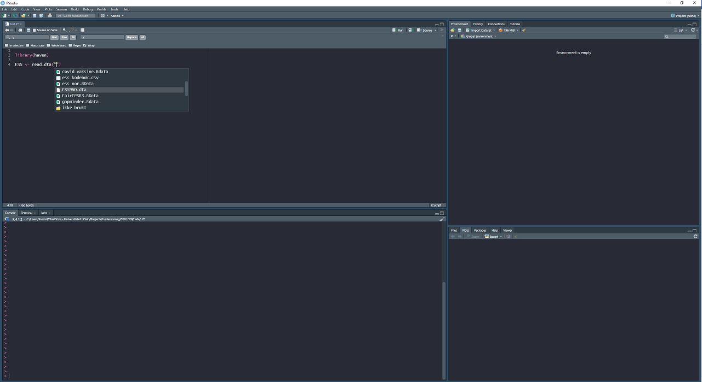

## Veiledning for innlastning av data

Når du skal laste inn et datasett til RStudio, og det oppstår problemer, bør du først sjekke disse tingene: 

1. Pass på at du enten åpner prosjektfilen din eller setter «working directory» til en mappe du finner igjen. F.eks kan du lage en mappe som heter «R-seminar» på skrivebordet, og så lage undermapper for hvert seminar. Dere kan sette working directory som vist under, eller bruke koden `setwd()`. Hvis dere vil dobbeltsjekke, bruk koden `getwd()`.


2. Legg datasett-filen i samme mappe som du har lagret prosjektfilen din i eller som du har satt som working directory. På bildet under ser dere hvordan jeg har gjort det. 


3. Dobbeltsjekk koden du skriver i RStudio, sjekk for skrivefeil, parenteser og hermetegn, og at filnavnet er det samme som du har lagret filen som. 

Bruk gjerne tab for å finne frem filen din for å unngå problemer med skrivefeil. Still markøren i hermetegnene i koden for å laste inn data og trykk på tab-knappen (hvilken knapp det er kan du google) for å liste opp mapper og filer i working directory/prosjektmappen din. Om datafilen er lagret i working directory/prosjektmappen så bør den komme opp i en liste som vist i bildene under.





## Koder for å laste inn ulike filtyper

Her er de ulike kodene for å laste inn filtyper. Der det står "navn" er navnet dere gir objektet, dette finner dere på selv.
Der det står "file" skal dere sette inn filnavnet. Altså det filen heter i mappen dere lagret den i. 


# Excel-fil (slutter på f.eks. .xlsx)


```r
install.packages("readxl")
library(readxl)

navn <- read_excel("file")
```


# CSV-fil (slutter på f.eks. .csv)


```r
navn <- read.csv("file")  
navn <- read.csv2("file")
```

# RData-fil (slutter på .Rdata)


```r
load("file")
# Merk at her gir du ikke datasettet et eget navn
```

# Stata-fil (slutter på .dta)


```r
install.packages("haven")
library(haven)

navn <- read_dta("file")
```

# SPSS-fil (slutter på .sav) 


```r
install.packages("haven")
library(haven)

navn <- read_sav("file")
```

Vær obs på at variabler som egentlig er faktorer kan bli lest som numeriske ved bruk av `haven`. Derfor er det ekstra viktig å sjekke kodebok og/eller labels.

Hvis dere har fulgt stegene over, men likevel ikke får lastet inn data-settet:

1.	Sjekk om pakkene du har installert er oppdatert. For å undersøke om noen av pakkene trenger en oppdatering, kan dere trykke på ‘tools’ og ‘check for package updates’.
2.	Hvis du har mac, sjekk at macen din er oppdatert. Er du usikker på hvordan så se på [Apple sine support-sider](https://support.apple.com/en-us/HT201541)  
3.	Sjekk at du har riktig versjon av R og Rstudio for Mac-en din (er du usikker så sjekk [installasjonsveiledningen](https://github.com/liserodland/STV1020/blob/main/doc/Installasjonsguide.md) 


Hvis dere har gått gjennom alle stegene, og likevel ikke får lastet inn datasettene så er neste steg å gå innom [kodekafé](https://www.sv.uio.no/isv/english/research/courses/coffeeandcode.html) for å få hjelp.


## Undersøke at `tidyverse` er installert

For å undersøke om tidyverse er installert kan dere kjøre denne koden. Du skal få opp et plot nederst til høyre når du kjører koden:


```r
# Install.packages er ikke nødvendig å kjøre om du allerede har installert pakken
install.packages("tidyverse") 
library(tidyverse)
data <- data.frame(x = c(1,1,1,2,2,3,4,4,5))
ggplot(data = data, aes(x = x)) +
  geom_bar()
```


Plottet skal se omtrent slik ut:


