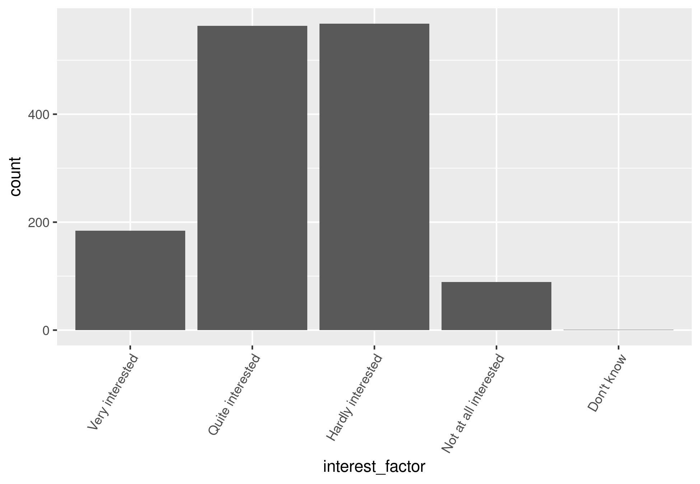
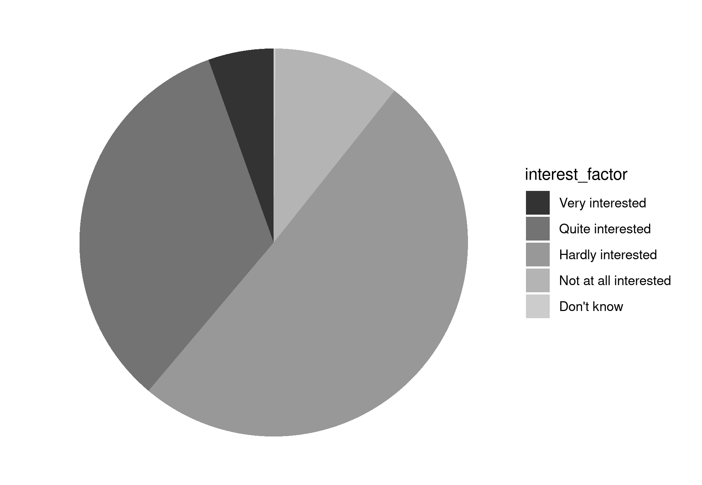
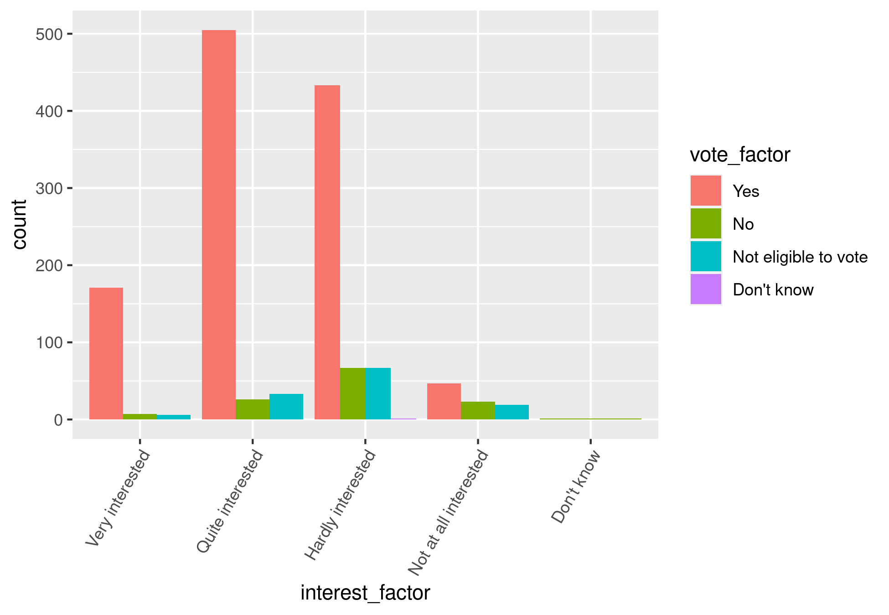
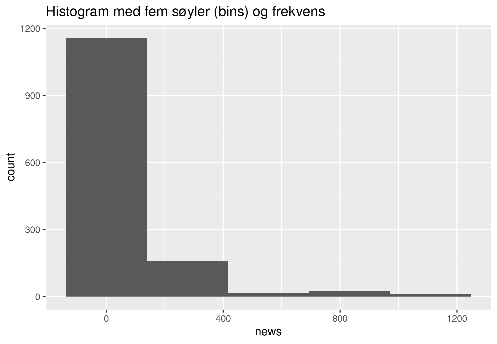
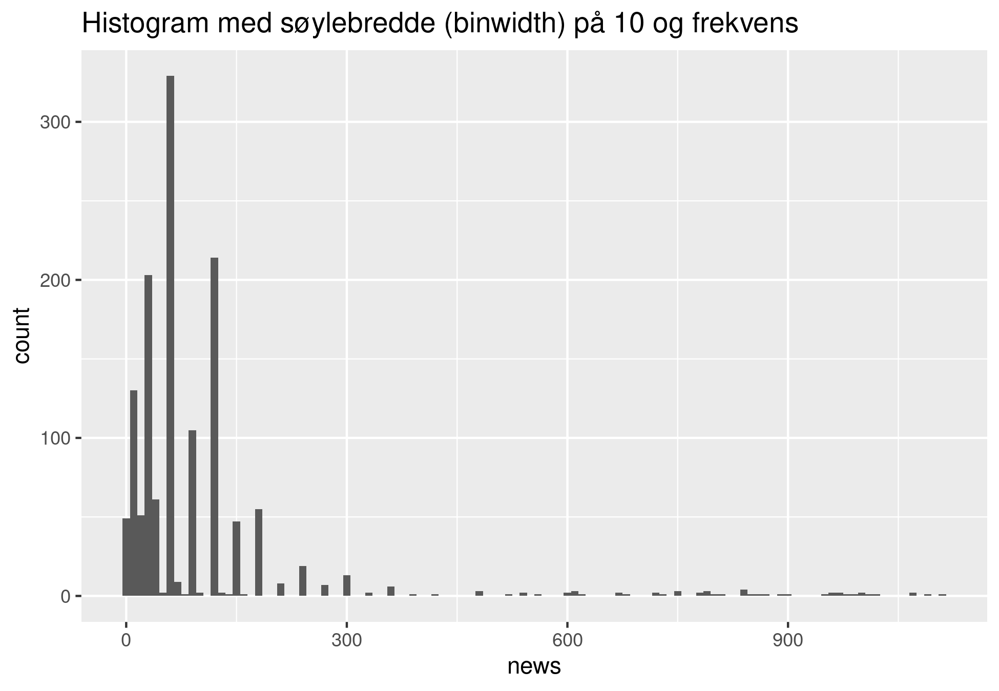
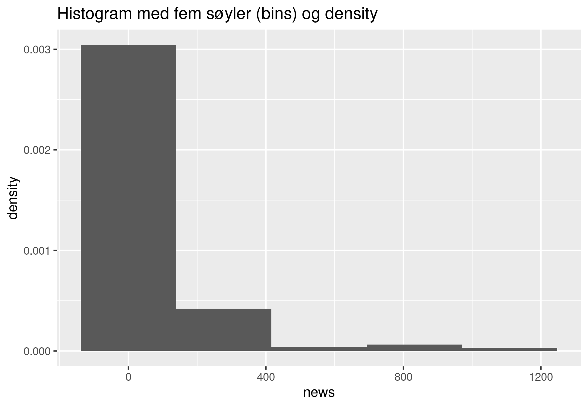

På seminar to skal vi se på det følgende: 

1. Organisering av arbeidet 
2. Pakker 
3. Laste inn data 
4. Organisering av data
5. Klasser og målenivå
6. Deskriptiv statistikk
7. Plotting 


# Organisering av arbeidet

Når vi jobber R så kan vi organisere arbeidet vårt på to måter: 
1. Bruke prosjekter 
2. Sette working directory

Working directory angir den mappen vi ønsker å hente og lagre filer til. Du kan tenke på det som den mappen du lagret prosjektfilen din i på første seminar. Når du åpner prosjektfilen din så husker R hvilken mappe dette er, men dersom du ikke jobber i prosjekt må du fortelle R hvilken mappe du vil hente og lagre filer i.  

Om du ikke jobber i prosjekt så kan du enten bruke `setwd("filbane")` eller trykke deg frem via verktøylinjen. Da velger du Session -> Set Working Directory -> Choose Directory og klikker deg frem til mappen din. 

Her er et eksempel på bruk av `setwd()`:

```r
setwd("~/Dokumenter/STV1020")
```

I dette seminaret skal vi bruke et datasett fra European Social Survey Round 9 (2018). Dette datasettet inneholder svarene fra norske respondenter. Filen heter "ESS9NO.dta" og ligger i Canvas.

Pass på at du har lagret datasettet vi skal bruke i dag i samme mappe som du har prosjektfilen din i eller mappen som du setter som working directory.


## Overskrifter og tekst

Hvordan man organiserer et R-script kommer an på hva man selv synes er mest oversiktlig, men det er viktig at man klarer å holde oversikt over hva man har kodet og forstår hva man har gjort når man kommer tilbake til et script. 

Det er lurt å lage overskrifter for å huske hva du tenker at koden din skal gjøre. Dersom du velger overskriftformatet "# Overskrift ----" så vil R automatisk gi deg muligheten til å gjemme koden under overskriften. Om du trykker på "Show document outline" i menylinjen til høyre over scriptet ditt kan du også få opp en innholdsfortegnelse basert på overskriftene dine. 


Det kan også være lurt å inkludere kommentarer i scriptet ditt  som forklarer hva du gjør. Tekst som ikke skal leses av R skriver man etter emneknagg (#). Vi glemmer fort så det er en god idé å tenke at du skal kunne se tilbake på dette scriptet om et år igjen og skjønne hva du har gjort. 

Til sist så er det lurt å ikke skrive for mange tegn før du bytter linje. [The tidyverse style guide](https://style.tidyverse.org/syntax.html#long-lines) anbefaler at en begrenser antall tegn til 80 per linje. R teller for hvor mange tegn du har per linje til venstre nedenfor scriptet ditt. Tidyverse sin stilguide inneholder også flere tips til hvordan man kan skrive lettleselig kode. 


# Pakker 

R-pakker er utvidelser til programmeringsspråket R. De inneholder kode, data, og dokumentasjon som gir oss tilgang til funksjoner som løser ulike problemer og gjør koding enklere. Første gang man skal bruke en pakke må man installere den. Etter at vi har installert pakken så må vi "hente den fra biblioteket" for å fortelle R at vi ønsker å bruke pakken. Dette må vi gjøre hver gang vi åpner R på nytt og ønsker å bruke pakken.

Den første pakken vi skal installere er Tidyverse. Tidyverse er et sett med pakker som gjør databehandling mye, mye enklere. Føst installerer vi pakken. Om dere har gjort dette på forhånd trenger dere ikke gjøre dette på nytt. Å installere gjør vi kun en gang. Vi installerer pakker ved hjelp av funksjonen `install.packages("pakkenavn")`: 


```r
install.packages("tidyverse")
```

Det neste vi gjør er å laste inn pakken ved hjelp av `library()`:


```r
library(tidyverse)
```

```
## -- Attaching packages --------------------------------------- tidyverse 1.3.1 --
```

```
## v ggplot2 3.3.5     v purrr   0.3.4
## v tibble  3.1.6     v dplyr   1.0.7
## v tidyr   1.2.0     v stringr 1.4.0
## v readr   2.1.2     v forcats 0.5.1
```

```
## -- Conflicts ------------------------------------------ tidyverse_conflicts() --
## x dplyr::filter() masks stats::filter()
## x dplyr::lag()    masks stats::lag()
```

Merk at pakkenavnet ikke står i hermetegn når vi bruker `library()`. Hermetegn rundt pakkenavnet er bare nødvendig når vi bruker `install.packages()`.

# Laste inn data 

Dersom dere skal gjøre statistisk analyse, er som regel den første seksjonen import og forberedelse av data. En styrke ved R, er at det er mulig å importere mange ulike filtyper, både fra en mappe på pcen din og fra en url på internett. Det er også mulig å ha flere datasett oppe i R samtidig. Jeg går gjennom import av filer fra excel, stata, spss og R i dette dokumentet, men vit at det finnes mange andre muligheter. Hvis man lurer på hvordan man skal laste inn en bestemt filtype og har glemt hvordan man gjør det så er dette veldig lett å finne på internett. 

Når du skal laste inn eller lagre noe lokalt på pc-en så vil R til enhver tid forvente at filen du refererer til befinner seg i working directory. Som vi husker så er working directory en mappe på pcen din; enten den du har lagret prosjektet ditt i eller den du har satt som working directory ved hjelp av `setwd()`. For å sjekke hva nåværende working directory er, og hvilke filer som finnes i den mappen, kan du skrive følgende kode:


```r
getwd()
```

```
## [1] "C:/Users/liserod/OneDrive - Universitetet i Oslo/Projects/Undervisning/STV1020/doc/seminar2"
```

```r
list.files()
```

```
## [1] "seminar2.md"    "seminar2.pdf"   "seminar2.Rmd"   "seminar2_files"
```
Datasett kommer i mange ulike filformater. Noen vanlige formater er csv, dta (Stata-datasett), sav (SPSS-datasett) og Rdata. Hvilket format dataene dine har bestemmer hvilken funksjon du må bruke for å laste inn datasettet. For det meste så følger funksjonene dette formatet: 


```r
# Laster inn og lagrer datasettet som et objekt:
datasett <- read_filtype("filbane/filnavn.filtype") 
```

For eksempel så er datasettet vi skal bruke i dag en dta-fil. Pakken `haven` inneholder funksjoner for å lese dta-filer og sav-filer. Det første vi gjør er derfor å installere og laste inn `haven`. 


```r
install.packages("haven")
```


```r
library(haven)

ess <- read_dta("../../data/ESS9NO.dta")
```

Her er eksempler på noen andre funksjoner for å laste inn data:


```r
# For csv-format:
datanavn <- read_csv("data/filnavn.csv") 

# For filer i Rdata-format:
load("data/filnavn.Rdata")
```

For å laste inn en excel-filer bruker vi pakken `readxl`:


```r
install.packages("readxl")

library(readxl)

datanavn <- read_excel("data/filnavn.xlsx")
```

# Organisering av data

Når man bruker større datasett som ESS, så inneholder datasettet ofte mange flere variabler enn de vi ønsker å bruke i våre analyser og variablene har navn som kan være vanskelig å huske, f.eks. nwspol. For å finne ut hvilken informasjon variablene inneholder så kan vi slå opp i kodeboken. Kodeboken til ESS finner dere [her](https://www.europeansocialsurvey.org/docs/round9/survey/ESS9_appendix_a7_e03_1.pdf). ESS inneholder også mange landspesisifkke variabler og kodeboken er derfor veldig lang.

Når vi skal jobbe videre med data så kan det være lurt å fjerne de variablene vi ikke skal bruke og gi variablene navn som er lette for oss å forstå og huske. For å gjøre dette skal vi benytte oss av funksjoner i `tidyverse`. Først bruker vi `select()` til å velge de variablene vi vil beholde og så bruker vi `rename()` til å endre navnene. Vi bruker en pipe `%>%` mellom funksjonene, som tar outputen til et utsagn og gjør det til inputen til det neste utsagnet. Pipen kan sees på som ordet "så". `rename()` lar oss forandre navnet til variabler og bruker syntaksen `rename(nytt_navn = gammelt_navn)`.


```r
ess_subset <- ess %>% 
  select(nwspol, polintr, vote, yrbrn) %>% 
  rename(
    	news = nwspol,
    	interest = polintr, 
    	year_born = yrbrn
  )
```

Dersom du har sjekket kodeboken på forhånd så kan du også endre variablenavnene når du bruker `select()`:


```r
ess_subset <- ess %>% 
  select(
    vote,
    news = nwspol,
    interest = polintr, 
    year_born = yrbrn
    )
```


Vi kan regne oss frem til alder ved å bruke variabelen `year_born`og informasjonen om at undersøkelsen ble gjennomført i 2018:


```r
ess_subset$age <- 2018 - ess_subset$year_born 
```


# Klasser og målenivå

I forelesning gikk dere gjennom tre ulike målenivåer; kategorisk, ordinalt og kontinuerlig. Disse sammen faller til en viss grad med noen av klassene i R. Men det er viktig å huske at R ikke vet hvilken klasse en variabel har så dere kan ikke nødvendigvis bruke dette til å sjekke variabelens målenivå. Det viktige er at dere gir R riktig informasjon om  hvilket målenivå en variabel har.  

## Kategorisk 

Når variabler er kategoriske så kan egenskapen deles i to eller flere gjensidig utelukkende kategorier. I ESS datasettet vårt er  variabelen "vote" kategorisk; man har enten stemt, ikke stemt, eller så er man ikke berettiget til å stemme. Dette kan vi se i utklippet fra kodeboken. 


Vi kan sjekke hvilken klasse variabelen har ved hjelp av `class()`

```r
class(ess_subset$vote)
```

```
## [1] "haven_labelled" "vctrs_vctr"     "double"
```
Her får vi opp klassene `haven_labelled`, `vctrs_vctr` og `double`. `haven_labelled` indikerer at datasettet også inneholder informasjon om verdilabels, mens `double` betyr at variabelen nå er lagret som en numerisk variabel. På variabler med kategorisk eller ordinalt målenivå såkan vi bruke funksjonen `table()` til å få oversikt over verdiene: 


```r
table(ess_subset$vote)
```

```
## 
##    1    2    3 
## 1156  124  125
```
Som vi ser her så fremstår variabelen som om den er kontinuerlig/numerisk med tallverdier, men vi har lest kodeboken og vet at den er kategorisk. Dersom vi vil endre klassen på variabelen til en faktor så det samsvarer bedre med målenivået så kan vi bruke funksjonen `as_factor()` for å opprette en ny variabel:


```r
# Lager en ny variabel i datasettet som heter vote_factor
ess_subset$vote_factor <- as_factor(ess_subset$vote)
```

Vi kan nå se nærmere på hvilke verdier den nye variabelen `vote_factor` tar ved hjelp av `levels()` og klassen ved hjelp av `class()`:  


```r
# Sjekker faktornivåene:
levels(ess_subset$vote_factor)
```

```
## [1] "Yes"                  "No"                   "Not eligible to vote"
## [4] "Don't know"           "Refusal"              "No answer"
```

```r
# Sjekker klasse:
class(ess_subset$vote_factor)
```

```
## [1] "factor"
```

Nå samsvarer variabelens verdier (`Yes`, `No`, osv.) og klasse (`factor`) bedre med det faktiske målenivået til variabelen (kategorisk). 

Merk at bruken av `as_factor()` er forbehold datasett som inneholder labels sånn som ESS-datasettet vi jobber med i dag. Vi skal jobbe mer med omkoding av variabler senere. 


## Ordinalnivå

Når variabler er på ordinalnivå kan de deles i to eller flere gjensidig utelukkende kategorier som kan rangeres, men vi kan ikke si noe om avstanden mellom verdiene og en enhets økning har ikke samme betydning. I ESS datasettet vår så er variabelen `interest` et eksempel på en variabel på ordinalnivå; i utdraget fra kodeboken ser vi at man kan være ikke interessert, lite interessert, ganske interessert, eller veldig interessert i politikk. 


Vi kan sjekke klasse til denne variabelen også:


```r
class(ess_subset$interest)
```

```
## [1] "haven_labelled" "vctrs_vctr"     "double"
```
Som vi ser er også denne variabelen også registrert som klassene `haven_labelled`, `vctrs_vctr` og `double` av R. Dersom vi vil bruke denne variabelen som en kategorisk variabel så kan vi igjen bruke `as_factor` for å få variabelens klasse til å samsvare med målenivået: 


```r
ess_subset$interest_factor <- as_factor(ess_subset$interest)
```


Vi sjekker faktornivåer og klasse igjen:


```r
# Sjekker faktornivåene:
levels(ess_subset$interest_factor)
```

```
## [1] "Very interested"       "Quite interested"      "Hardly interested"    
## [4] "Not at all interested" "Don't know"            "Refusal"              
## [7] "No answer"
```

```r
# Sjekker klasse:
class(ess_subset$interest_factor)
```

```
## [1] "factor"
```

Dette ser også fint ut. Som dere vet fra forelesning så er behandler man ofte variabler på ordinalnivå som enten kategorisk eller kontinuerlig målenivå. Dersom vi ville beholdt denne som en kontinuerlig variabel så hadde vi ikke trengt å omkode den ved hjelp av `as_factor()`. 

## Kontinuerlig

Kontinuerlige variabler kan rangeres, har samme avstand mellom alle verdier og en enhets økning betyr alltid det samme. Her er det altså snakk om variabler med faktiske tallverdier. I ESS datasettet vårt så er variabelen "news" kontinuerlig. Som vi kan se i utdraget fra kodeboken så måler variabelen hvor mange minutter man bruker på nyheter hver dag. Det er et minutts avstand mellom hver verdi, og en økning på en enhet vil alltid bety en økning på et minutt. 


Vi kan sjekke klassen her også: 


```r
class(ess_subset$news)
```

```
## [1] "haven_labelled" "vctrs_vctr"     "double"
```

```r
is.numeric(ess_subset$news)
```

```
## [1] TRUE
```

Denne variabelen er `double` og skal være det så her er alt i orden. 

Jeg vil oppfordre dere til å være obs og alltid sjekke at klassen på en variabel dere skal bruke stemmer overens med målenivået. I mange datasett får kategoriske og ordinale variabler ofte tall istedenfor kategorinavn som verdier og lastes inn som klassen numeric. Dette gjør at kategoriske variabler kan fremstå som at de har et høyere målenivå enn de faktisk har i R. Derfor er det alltid viktig å også sjekke kodeboken for å se hvilket målenivå variabelen faktisk har. Det kommer ikke til å stå "denne variabelen har kategorisk målenivå" så dere må gjøre en selvstendig vurdering basert på hvilke verdier variabelen har. 

# Utforske data
Vi skal nå bli litt bedre kjent med dataene våre. Det er mange ulike måter å utforske datasett og variabler på. Vi skal se på funksjonene `summary()`, `str()`, `head()` og `tail()`. 

For å få et deskriptivt sammendrag av et objekt kan vi bruke `summary()` eller str().

```r
summary(ess_subset)
```

```
##       vote            news           interest     year_born         age       
##  Min.   :1.000   Min.   :   0.0   Min.   :1.0   Min.   :1928   Min.   :15.00  
##  1st Qu.:1.000   1st Qu.:  30.0   1st Qu.:2.0   1st Qu.:1957   1st Qu.:32.00  
##  Median :1.000   Median :  60.0   Median :2.0   Median :1971   Median :47.00  
##  Mean   :1.266   Mean   : 104.1   Mean   :2.4   Mean   :1971   Mean   :46.54  
##  3rd Qu.:1.000   3rd Qu.: 120.0   3rd Qu.:3.0   3rd Qu.:1986   3rd Qu.:61.00  
##  Max.   :3.000   Max.   :1109.0   Max.   :4.0   Max.   :2003   Max.   :90.00  
##  NA's   :1       NA's   :34       NA's   :1     NA's   :32     NA's   :32     
##                vote_factor                interest_factor
##  Yes                 :1156   Very interested      :184   
##  No                  : 124   Quite interested     :564   
##  Not eligible to vote: 125   Hardly interested    :568   
##  Don't know          :   1   Not at all interested: 89   
##  Refusal             :   0   Don't know           :  1   
##  No answer           :   0   Refusal              :  0   
##                              No answer            :  0
```

```r
str(ess_subset)
```

```
## tibble [1,406 x 7] (S3: tbl_df/tbl/data.frame)
##  $ vote           : dbl+lbl [1:1406] 1, 1, 1, 1, 1, 1, 1, 3, 1, 1, 1, 1, 1, 1, 2, 1, 1, 1,...
##    ..@ label       : chr "Voted last national election"
##    ..@ format.stata: chr "%20.0g"
##    ..@ labels      : Named num [1:6] 1 2 3 NA NA NA
##    .. ..- attr(*, "names")= chr [1:6] "Yes" "No" "Not eligible to vote" "Refusal" ...
##  $ news           : dbl+lbl [1:1406]    60,    60,   540,    30,    60,   120,    60,    9...
##    ..@ label       : chr "News about politics and current affairs, watching, reading or listening, in min"
##    ..@ format.stata: chr "%12.0g"
##    ..@ labels      : Named num [1:3] NA NA NA
##    .. ..- attr(*, "names")= chr [1:3] "Refusal" "Don't know" "No answer"
##  $ interest       : dbl+lbl [1:1406] 3, 2, 2, 2, 2, 1, 2, 3, 2, 2, 1, 2, 2, 3, 1, 2, 2, 3,...
##    ..@ label       : chr "How interested in politics"
##    ..@ format.stata: chr "%21.0g"
##    ..@ labels      : Named num [1:7] 1 2 3 4 NA NA NA
##    .. ..- attr(*, "names")= chr [1:7] "Very interested" "Quite interested" "Hardly interested" "Not at all interested" ...
##  $ year_born      : dbl+lbl [1:1406] 1961, 1960, 1956, 1967, 1972, 1964, 1959, 2000, 1950,...
##    ..@ label       : chr "Year of birth"
##    ..@ format.stata: chr "%12.0g"
##    ..@ labels      : Named num [1:3] NA NA NA
##    .. ..- attr(*, "names")= chr [1:3] "Refusal" "Don't know" "No answer"
##  $ age            : num [1:1406] 57 58 62 51 46 54 59 18 68 43 ...
##  $ vote_factor    : Factor w/ 6 levels "Yes","No","Not eligible to vote",..: 1 1 1 1 1 1 1 3 1 1 ...
##   ..- attr(*, "label")= chr "Voted last national election"
##  $ interest_factor: Factor w/ 7 levels "Very interested",..: 3 2 2 2 2 1 2 3 2 2 ...
##   ..- attr(*, "label")= chr "How interested in politics"
```

Hvis man vil se de første eller siste radene i et datasett så kan man bruke henholdsvis `head()` og `tail()`.


```r
head(ess_subset)
```

```
## # A tibble: 6 x 7
##        vote      news       interest year_born   age vote_factor interest_factor
##   <dbl+lbl> <dbl+lbl>      <dbl+lbl> <dbl+lbl> <dbl> <fct>       <fct>          
## 1   1 [Yes]        60 3 [Hardly int~      1961    57 Yes         Hardly interes~
## 2   1 [Yes]        60 2 [Quite inte~      1960    58 Yes         Quite interest~
## 3   1 [Yes]       540 2 [Quite inte~      1956    62 Yes         Quite interest~
## 4   1 [Yes]        30 2 [Quite inte~      1967    51 Yes         Quite interest~
## 5   1 [Yes]        60 2 [Quite inte~      1972    46 Yes         Quite interest~
## 6   1 [Yes]       120 1 [Very inter~      1964    54 Yes         Very interested
```

```r
tail(ess_subset)
```

```
## # A tibble: 6 x 7
##            vote        news interest year_born   age vote_factor interest_factor
##       <dbl+lbl>   <dbl+lbl> <dbl+lb> <dbl+lbl> <dbl> <fct>       <fct>          
## 1 1 [Yes]          90       1 [Very~      1955    63 Yes         Very interested
## 2 3 [Not eligi~    20       2 [Quit~      2003    15 Not eligib~ Quite interest~
## 3 1 [Yes]          30       3 [Hard~      1994    24 Yes         Hardly interes~
## 4 1 [Yes]          60       2 [Quit~      1984    34 Yes         Quite interest~
## 5 2 [No]        NA(c) [Don~ 3 [Hard~      1974    44 No          Hardly interes~
## 6 1 [Yes]          30       3 [Hard~      1988    30 Yes         Hardly interes~
```

Alle disse funksjonene kan også brukes på enkeltvariabler. 

# Deskriptiv statistikk

Som dere husker fra forelesning og fra kapittel seks i Kellsted og Whitten så er det variabelens målenivå som avgjør hvilken deskriptiv statistikk som er fornuftig. 

## Kategoriske variabler 

R har ingen innebygd funksjon for å finne modusverdien. Ved å søke på internett så finner du fort mange ulike funksjoner du kan bruke, men for å gjøre det enkelt bruker vi bare `table()`. Funksjonen `table()` gir oss en frekvenstabell, mens `prop.table` gjør om frekvenstabellen til andeler. ESS datasettet mangler data for noen observasjoner. Ved å ta med `useNA = "always"` i `table()` så får vi også denne informasjonen i tabellen:

```r
table(ess_subset$vote, useNA = "always")
```

```
## 
##    1    2    3 <NA> 
## 1156  124  125    1
```

```r
prop.table(table(ess_subset$vote))
```

```
## 
##          1          2          3 
## 0.82277580 0.08825623 0.08896797
```

```r
prop.table(table(ess_subset$vote, useNA = "always"))
```

```
## 
##            1            2            3         <NA> 
## 0.8221906117 0.0881934566 0.0889046942 0.0007112376
```

## Kontinuerlige variabler


```r
# Finner minimumsverdi (det laveste antall minutter brukt på nyheter)
min(ess_subset$news, na.rm = TRUE) # na.rm = TRUE sier at missing skal droppes i beregningen
```

```
## <labelled<double>[1]>: News about politics and current affairs, watching, reading or listening, in min
## [1] 0
## 
## Labels:
##  value      label
##  NA(b)    Refusal
##  NA(c) Don't know
##  NA(d)  No answer
```

```r
# Finner maksimumsveriden (den høyeste antall minutter brukt på nyheter)
max(ess_subset$news, na.rm = TRUE)
```

```
## <labelled<double>[1]>: News about politics and current affairs, watching, reading or listening, in min
## [1] 1109
## 
## Labels:
##  value      label
##  NA(b)    Refusal
##  NA(c) Don't know
##  NA(d)  No answer
```

```r
# Finner gjennomsnittlig antall minutter
mean(ess_subset$news, na.rm = TRUE)
```

```
## [1] 104.1006
```

```r
# Finner median
median(ess_subset$news, na.rm = TRUE)
```

```
## [1] 60
```

```r
# Finner standardavviket
sd(ess_subset$news, na.rm = TRUE)
```

```
## [1] 155.5571
```

```r
# Finner varians
var(ess_subset$news, na.rm = TRUE)
```

```
## [1] 24198.01
```

```r
# Finner kvantilverdiene
quantile(ess_subset$news, na.rm = TRUE)
```

```
##   0%  25%  50%  75% 100% 
##    0   30   60  120 1109
```

```r
# Finner forskjellig deskriptiv statistikk for en variabel
summary(ess_subset$news)
```

```
##    Min. 1st Qu.  Median    Mean 3rd Qu.    Max.    NA's 
##     0.0    30.0    60.0   104.1   120.0  1109.0      34
```

# Plotting

Vi skal kort introdusere hvordan man kan visualisere data i dette seminaret, og så vil dere få en mer grundig gjennomgang neste seminar. Det er gøy å kunne visualisere dataene våre, både for vår egen del, men også for de som skal lese oppgavene våre. For å få fine grafer kan man bruke funksjonen `ggplot()`.

## Kategoriske variabeler

### Søylediagram og kakediagram med en variabel
Hvordan kan vi visualisere hvordan fordelingen av politisk interesse er? Her kan vi bruke `geom_bar` til å lage et søylediagram (bar chart). Et søylediagram viser antall observasjoner av hver verdi. Vi bruker her den variabelen vi lagde tidligere med "riktig" målenivå.


```r
ggplot(data = ess_subset, aes(x = interest_factor)) + 
  geom_bar() +
  theme(axis.text.x = element_text(angle = 60, hjust = 1))
```


Dersom vi ikke ønsker å gi missingverdiene (NA) en egen søyle så kan vi bruke `filter()` til å fjerne disse: 


```r
ggplot(data = ess_subset %>% 
         filter(!is.na(interest_factor)), 
       aes(x = interest_factor)) + 
  geom_bar() +
  theme(axis.text.x = element_text(angle = 60, hjust = 1))
```




Et alternativ til søylediagram er kakediagram (pie chart): 


```r
ggplot(ess_subset, aes(x = "", y = interest, fill = interest_factor)) + 
  geom_bar(stat = "identity", width = 1) + 
  coord_polar("y", start = 0) +
  theme_void() +
  scale_fill_grey()
```





### Søylediagram med to variabler
Hvor mange innenfor hvert nivå av politisk interesse stemte? Vi kan bruke `geom_bar()` igjen, men vi sier at vi også vil se fordelingen av hvordan respondentene stemte innenfor hvert nivå av politisk interesse med `(aes(fill = vote))`. Så sier vi at vi vil at det skal være en søyle for de ulike alternativene for vote med `position = "dodge"`. 


```r
ggplot(data = ess_subset, 
       aes(x = interest_factor)) + 
  geom_bar(aes(fill=vote_factor),
           position = "dodge") +
  theme(axis.text.x = element_text(angle = 60, hjust = 1))
```




## Kontinuerlige variabler
### Histogram
Hvordan fordeler respondentenes alder og tiden de bruker på nyheter seg? Disse variablene er kontinuerlige, så vi kan bruke `geom_histogram` for å lage et histogram. Her gjør jeg det med variabelen news. 


```r
ggplot(data = ess_subset, aes(x = news)) +
 	  geom_histogram(bins = 5) +
  ggtitle("Histogram med fem søyler (bins) og frekvens")
```





```r
ggplot(data = ess_subset, aes(x = news)) +
  geom_histogram(binwidth = 10) +
  ggtitle("Histogram med søylebredde (binwidth) på 10 og frekvens")
```





Et histogram viser hvor mange enheter det er i hver kategori. Vi kan enten spesifisere hvor mange søyler vi vil ha (bins) eller hvor stor hver søyle skal være (bindwidth). Vi kan også velge å plotte density fremfor count. Da får vi histogrammer tilsvarende figur 6.5 i Kellsted og Whitten: 


```r
ggplot(data = ess_subset, aes(x = news, y = ..density..)) +
 	  geom_histogram(bins = 5) +
  ggtitle("Histogram med fem søyler (bins) og density")
```





```r
ggplot(data = ess_subset, aes(x = news, y = ..density..)) +
  geom_histogram(binwidth = 10) +
  ggtitle("Histogram med søylebredde (binwidth) 10 og density")
```


### Boksplott
Vi kan lage et boksplott med `geom_boxplot.` Et boksplott viser hvordan en kontinuerlig variabel er fordelt. Boksen representerer spennet til første (25 % ) og tredje (75 %) kvartil, mens streken midt i boksen viser andre (50 %) kvartil (også kjent som median). For å finne kvartilene så ordner vi observasjonene i stigende rekkefølge og deler dem inn i fire deler med like mange observasjoner i hver. Første kvartil angir grensen mellom første og andre fjerdedel. Det betyr at 25 % av observasjonene har en verdi som er lavere enn verdien til første kvartil, mens 75 % har en verdi som er høyere. Tilsvarende utgjøre tredje kvartil grensen mellom andre og tredje fjerdedel, og vi kan si at 75 % av observasjonene har en verdi som er lavere enn verdiene til tredje kvaritl, mens 25 % har en verdi som er høyere. 

Prikkene i grafen angir uteliggere. Uteliggere er observasjoner som har enten veldig høye eller veldig lave verdier relativt til de andre observasjonene. I R beregnes disse utfra kvartilbredden. Kvartilbredden er differansen mellom tredje og første kvartil. Alle observasjoner som er lavere enn første kvartil minus 1,5 ganger kvartilbredden eller høyere enn tredje kvartil pluss 1,5 ganger kvartilbredden regnes som uteliggere. 


```r
ggplot(data = ess_subset, aes(x = news)) +
  geom_boxplot() +
  theme_minimal()
```


Hvis dere vil utforske hvordan man kan tilpasse de ulike diagrammene vi har sett på og mange andre, kan denne siden være nyttig: https://www.r-graph-gallery.com/index.html
