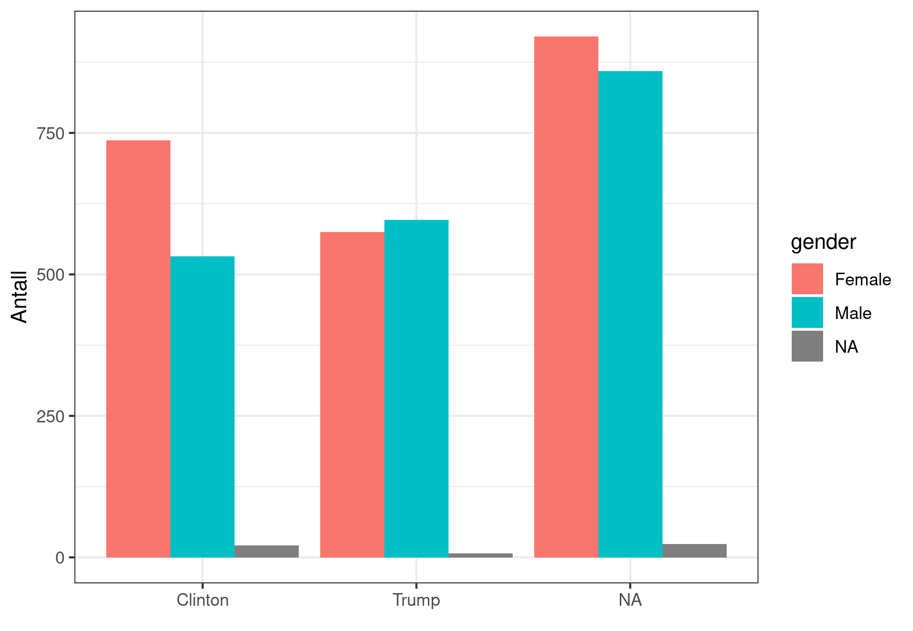
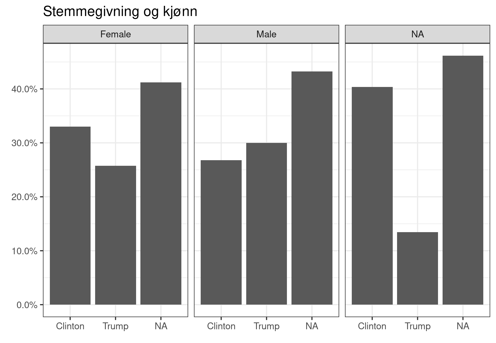
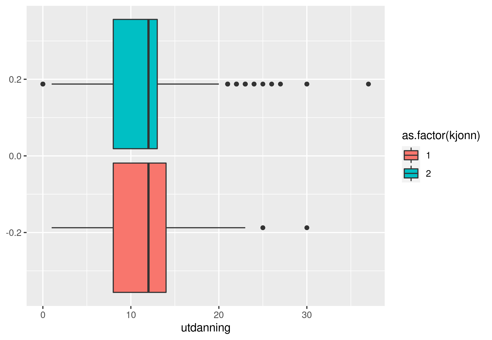
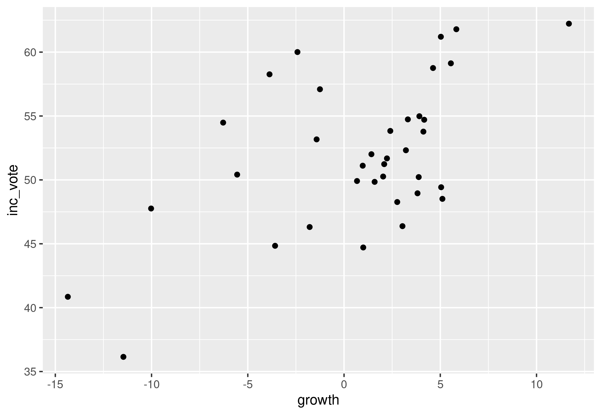
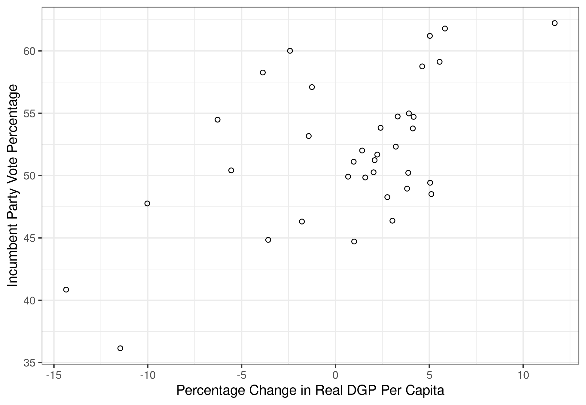

I løpet av dette seminaret skal vi: 

1. Repetere litt om pakker og innlastning av data. 
2. Missingverdier (NA).
3. Statistiske mål.
4. Univariat analyse.
5. Bivariat analyse.

# Repetisjon 
## Pakker og funksjoner
Når vi jobber i R så bruker vi mange funksjoner. Noen av disse, som for eksempel `mean()` og `load()` er en del av base R. Det betyr at vi ikke trenger å installere og laste inn noen ekstra pakker for at de skal virker. Andre funksjoner som for eksempel `%>%`, `read.dta()` og `ggplot()` ligger i pakker. Da må vi installere og laste inn disse pakkene for å kunne bruke funksjonen. 

*Installere pakker*: Vi bruker `install.packages("pakkenavn")` for å installere pakker. Dette trenger vi bare å gjøre en gang. 

*Laste inn pakker*: Vi bruker `library(pakkenavn)` for å laste inn en pakke. Dette må vi gjøre hver gang vi åpner Rstudio på nytt eller åpner en ny sesjon. Dersom du får opp en feilmelding som "Error in library(pakkenavn) : there is no package called ‘pakkenavn’" så indikerer det at du ikke har installert pakken. Da må du kjøre `install.packages("pakkenavn")` før du forsøker `library(pakkenavn)` igjen.  

Først installerer vi nye pakker og laster inn pakkene vi skal bruke i dagens seminar: 


```r
# Installerer nye pakker
install.packages("stargazer")
install.packages("gmodels")
install.packages("ggthemes")
install.packages("scales")
```


```r
# Laster inn pakker 
library(tidyverse)
```

```
## -- Attaching packages ----------------------------------------------------------------------------------------------- tidyverse 1.3.0 --
```

```
## v ggplot2 3.3.2     v purrr   0.3.4
## v tibble  3.0.3     v dplyr   1.0.2
## v tidyr   1.1.2     v stringr 1.4.0
## v readr   1.4.0     v forcats 0.5.0
```

```
## -- Conflicts -------------------------------------------------------------------------------------------------- tidyverse_conflicts() --
## x dplyr::filter() masks stats::filter()
## x dplyr::lag()    masks stats::lag()
```

```r
library(stargazer)
```

```
## 
## Please cite as:
```

```
##  Hlavac, Marek (2018). stargazer: Well-Formatted Regression and Summary Statistics Tables.
```

```
##  R package version 5.2.2. https://CRAN.R-project.org/package=stargazer
```

```r
library(gmodels)
library(ggthemes)
library(scales)
```

```
## 
## Attaching package: 'scales'
```

```
## The following object is masked from 'package:purrr':
## 
##     discard
```

```
## The following object is masked from 'package:readr':
## 
##     col_factor
```

# Laste inn data
Det neste vi skal gjøre er å laste inn data. Som vi allerede har snakket om så finnes det mange typer data og hver type krever egne koder for innlastning. På Canvas har jeg lastet opp et dokument som oppsummerer litt av dette. I dag skal vi bruke noen ulike datasett; et fra ESS og to fra Kellstedt og Whitten. Det første skal vi laste inn data i csv.-format ved hjelp av funksjonen `read.csv`:  


```r
# For å laste inn .csv-filer
data <- read.csv("../../data/internett.csv") 

# For å lagre .csv-filer
write.csv(data, file = "../../data/internett_ed.csv", row.names = FALSE)
```

Datasettet heter internettbruk og omhandler internettbruken til italienere. Det betstår av et utvalg variabler hentet fra European Social Survey (ESS) runde 9 (2018). Enhetene er italienske statsborgere og samlet innholder datasettet 2745 observasjoner og 5 variable: 

- Kjonn: Mann = 1, Kvinne = 2
- Alder: Alder til respondenten 
- Utdanning: Antall år med fullført utdanning 
- Tillit: Tillit til det italienske parlament (0-10), 0 = ingen tillit, 10 = fullstendig tillit 
- Internettbruk: Hvor ofte bruker respondenten internett? (1-5), 1 = aldri, 5 = hver dag. 

Før vi går videre vil vi se på dataene våre. Disse kodene har vi sett på tidligere, men vi repeterer det igjen. 

Vi kan bruke `View()` til å åpne en egen fane med datasettet vårt:

```r
View(data)
```

Vi kan bruke `head()` til å undersøke de seks første observasjonene og `tail()` til å undersøke de seks siste observasjonene: 


```r
head(data)
```

```
##   internettbruk kjonn alder utdanning tillit
## 1             5     2    67        18      8
## 2             5     1    45        11      6
## 3             1     2    73         8      0
## 4             5     1    21         8     NA
## 5             1     2    86         3      6
## 6             5     2    53        17      6
```

```r
tail(data)
```

```
##      internettbruk kjonn alder utdanning tillit
## 2740             2     1    78         2      8
## 2741             1     2    82        12      8
## 2742             3     1    44        10      6
## 2743             5     1    52        13      3
## 2744             5     2    58        13      7
## 2745             4     2    56         8      6
```

Vi kan bruke `summary()` på et datasett-objekt for å se målenivå, antall missingverdier og beskrivende statistikk: 


```r
summary(data) 
```

```
##  internettbruk       kjonn           alder         utdanning   
##  Min.   :1.000   Min.   :1.000   Min.   :16.00   Min.   : 0.0  
##  1st Qu.:2.000   1st Qu.:1.000   1st Qu.:36.00   1st Qu.: 8.0  
##  Median :5.000   Median :2.000   Median :52.00   Median :12.0  
##  Mean   :3.629   Mean   :1.527   Mean   :51.28   Mean   :11.5  
##  3rd Qu.:5.000   3rd Qu.:2.000   3rd Qu.:67.00   3rd Qu.:14.0  
##  Max.   :5.000   Max.   :2.000   Max.   :90.00   Max.   :37.0  
##  NA's   :5                       NA's   :21      NA's   :85    
##      tillit      
##  Min.   : 0.000  
##  1st Qu.: 2.000  
##  Median : 5.000  
##  Mean   : 4.251  
##  3rd Qu.: 6.000  
##  Max.   :10.000  
##  NA's   :89
```


# Missing (NA/Not available)

Det finnes mange grunner til at det er tomme celler/manglende verdier/svar i dataene. I datasett basert på spørreundersøkelser som ESS så kan det hende at noen respondenter ikke har ønsket å svare på alle spørsmål. I andre tilfeller kan det hende vi rett og slett mangler dataen. Vi skal nå se på hvordan vi kan finne missing-verdier og hva vi kan gjøre med dem i R. Når dere skal gjøre egne analyser så er det er viktig å teoretisk begrunne hvordan man håndterer NA-verdier på bakgrunn av utvalget av populasjonen. Er missing-verdiene systematiske eller er de tilfeldige? 

Når vi skal finne missing er det mest vanlig er å bruke funksjonen `is.na()`. `is.na()` tar utgangspunkt i en logisk test. For hver observasjon i et datasett eller en variabel så sjekker `is.na()` om det finnes missingverdier. Under ser dere et eksempel der jeg spør R om rad 1:6 i datasettet `data` har missingverdier. `slice_head(n = 6)` avgrenser datasettet til de seks første observasjonene: 


```r
is.na(data %>% 
        slice_head(n = 6))
```

```
##      internettbruk kjonn alder utdanning tillit
## [1,]         FALSE FALSE FALSE     FALSE  FALSE
## [2,]         FALSE FALSE FALSE     FALSE  FALSE
## [3,]         FALSE FALSE FALSE     FALSE  FALSE
## [4,]         FALSE FALSE FALSE     FALSE   TRUE
## [5,]         FALSE FALSE FALSE     FALSE  FALSE
## [6,]         FALSE FALSE FALSE     FALSE  FALSE
```
Som dere ser er verdiene i datasettet nå byttet ut med `FALSE` og `TRUE`. `TRUE` indikerer at observasjonen mangler data om denne variabelen. Et eksempel er observasjon/rad nummer 4 som mangler data på tillit-variabelen. `FALSE` indikerer at det finnes data. 

Vi kan kombinere `is.na()` med `sum()` for å finne totalt antall missingverdier. `sum()` kan brukes til å summere, for eksempel:


```r
sum(2,2,6)
```

```
## [1] 10
```
Når `sum()` kombineres med `is.na()` så kan vi tenke oss at `TRUE` gir verdien 1 og `FALSE` gir verdien 0. Det betyr at en observasjon får verdien 1 på en gitt variabel dersom informasjonen mangler og 0 om den ikke mangler. R summerer så opp alle disse verdiene og summen angir antall observasjoner med verdien 1, altså med manglende informasjon.  


```r
# Finner ut om de seks første observasjonene har missing på variabelen tilitt
is.na(data %>% 
        slice_head(n = 6) %>%  # Beholder bare de seks første observasjonene
        select(tillit))        # Beholder bare variabelen tillit
```

```
##      tillit
## [1,]  FALSE
## [2,]  FALSE
## [3,]  FALSE
## [4,]   TRUE
## [5,]  FALSE
## [6,]  FALSE
```

```r
# Teller antall missing blant de seks første observasjonene
sum(is.na(data %>% 
            slice_head(n = 6) %>% 
            select(tillit)))
```

```
## [1] 1
```
Vi kan kombinere `sum()` og `is.na()` til å telle totalt antall missingverdier i datasettet vårt. En rad, eller en observasjon, kan ha missing på flere variabler. Denne funksjonen vil telle alle disse. 


```r
sum(is.na(data)) 
```

```
## [1] 200
```

Vi kan kombinere `sum()`, `is.na()` og indeksering ved hjelp av `$` til å hente ut antall missingverdier på en variabel: 


```r
sum(is.na(data$internettbruk)) # Viser hvor mange missing det er på en variabel
```

```
## [1] 5
```

Vi kan kombinere `sum()` med en funksjon som heter `complete.cases()` for å finne ut hvor mange observasjoner vi *ikke* mangler noe informasjon på noen variabler om. Først skal vi se litt på hvilken informasjon `complete.cases()` gir oss: 


```r
complete.cases(data %>% 
                 slice_head(n = 6)) # Henter ut informasjon om de seks første observasjonene
```

```
## [1]  TRUE  TRUE  TRUE FALSE  TRUE  TRUE
```

Fra dette kan vi lese at de tre første og de to siste observasjonene ikke har noen missing, men den fjerde obsevarsjonen mangler informasjon på minst en variabel. Fra før vet vi at denne observasjonen mangler informasjon på variabelen tillit. Nå kombinerer vi `sum()` og `complete.cases()` for å finne antall observasjoner uten noen missing i datasettet vårt:


```r
sum(complete.cases(data)) 
```

```
## [1] 2562
```

Du kan også lese antall missing på hver variabel ut fra `summary`. Legg merke til at NAs (missingverdier) kommer til sist:


```r
# For alle variabler i datasettet
summary(data)
```

```
##  internettbruk       kjonn           alder         utdanning   
##  Min.   :1.000   Min.   :1.000   Min.   :16.00   Min.   : 0.0  
##  1st Qu.:2.000   1st Qu.:1.000   1st Qu.:36.00   1st Qu.: 8.0  
##  Median :5.000   Median :2.000   Median :52.00   Median :12.0  
##  Mean   :3.629   Mean   :1.527   Mean   :51.28   Mean   :11.5  
##  3rd Qu.:5.000   3rd Qu.:2.000   3rd Qu.:67.00   3rd Qu.:14.0  
##  Max.   :5.000   Max.   :2.000   Max.   :90.00   Max.   :37.0  
##  NA's   :5                       NA's   :21      NA's   :85    
##      tillit      
##  Min.   : 0.000  
##  1st Qu.: 2.000  
##  Median : 5.000  
##  Mean   : 4.251  
##  3rd Qu.: 6.000  
##  Max.   :10.000  
##  NA's   :89
```

```r
# For variabelen internettbrukt
summary(data$internettbruk)
```

```
##    Min. 1st Qu.  Median    Mean 3rd Qu.    Max.    NA's 
##   1.000   2.000   5.000   3.629   5.000   5.000       5
```

I en oppgave så vil en vanligvis kommenterer missingverdier. Vi må også velge hva vi skal gjøre med dem. Det er vanlig å fjerne NA hvis de er 'missing at random' eller 'missing completely at random'. Dersom informasjonen mangler systematisk kan du imidlertid ha et problem. Det kan skje dersom du for eksempel vil se på effekten av demokrati på BNP per capita, men bare har informasjon om BNP per capita for vestlige demokratier. Da kan ikke analysene dine si noe om effekten av demokrati på BNP per capita i alle land, men bare vestlige demokratier. Det samme kan en si for spørreundersøkelser dersom det er spesielle kjennetegn ved de som ikke har svart. 

Du kan velge å fjerne alle missing verdier eller bare missing verdier på spesifikke variable. Det er som når vi beregner gjennomsnittet - man kan ikke regne gjennomsnittet av missing, derfor må vi si til R hvordan R skal håndtere missing. 

Dersom en ønsker et datasett uten missingverdier så kan du bruke funksjonen `drop_na()`: 


```r
# Fjerne alle observajoner med minst en missing  
data1 <- data %>% 
  drop_na() 

# Fjerne alle observasjoner med missing på en variabel (eller fler) 
data2 <- data %>% 
  drop_na(internettbruk) # Du kan legge til flere variable med komma

# Vi skal ikke bruke data1 og data2 mer så jeg fjerner dem fra environment
rm(data1, data2)
```

Når dere skal skrive egne oppgaver så er det veldig viktig å lese kodeboken nøye. Noen ganger kommer manglende data kodet som for eksempel 999 eller 9999. Da kan R tror at dette er en faktisk verdi og ikke en missingverdi. I slike tilfeller må du omkode variabelen før du bruker den i analyser. 


# Statistiske mål
       
Statistiske mål forteller oss noe om fordelingen til ulike variabler, som for eksempel gjennomsnitt, median og standardavvik, men også minimum- og maksimumverdier, typetall og frekvens. Statistiske mål på sentraltendens er gjennomsnitt, median og modus. Disse har vi sett på i tidligere seminarer. Som vi har sett tidligere så kan vi få informasjon om dette ved å bruke samlefunksjonen `summary()` eller ved å bruke enkeltfunksjoner som for eksempel `mean()`, `min()` og `max()`. Ved bruk av enkeltfunksjonene så må vi huske å spesifisere `na.rm = TRUE` så R vet hvordan vi ønsker å håndtere missingverdier.  

Statistiske mål på spredning i dataene er standardavviket og varians. Standardavviket viser respondentenes gjennomsnittlige avstand fra gjennomsnittet. Vi kan bruke funksjonen `sd()`. Også her må vi spesifisere `na.rm = TRUE` for at R skal vite hvordan vi ønsker å håndtere missingverdier. Syntaksen for `sd()` er som `mean()`:


```r
sd(data$variabel, na.rm = TRUE)
```

Om vi ønsker å regne ut standardavviket for internettbruk så skriver vi: 


```r
sd(data$internettbruk, na.rm = TRUE)
```

```
## [1] 1.645191
```

Variansen er standardavviket opphøyd i annen. Dermed er standardavviket kvadratroten av variansen. Det er enklere å tolke standardavvik enn varians. Jeg viser likevel hvordan man finner variansen:


```r
# Lagrer variansen i et eget objekt
varians <- var(data$internettbruk, na.rm = TRUE)

varians
```

```
## [1] 2.706653
```

Vi kan bruke en logisk test for å sjekke om kvadratroten av variansen gir samme tall som standardavviket:


```r
# Lagrer først standardavviket i et objekt: 
stdavvik <- sd(data$internettbruk, na.rm = TRUE)

# Bruker logisk test for å spørre R om standardavviket er det samme som kvadrat-
# roten (sqrt) av variansen
stdavvik == sqrt(varians)
```

```
## [1] TRUE
```

Vi skal ikke bruke objektene `stdavvik` og `varians` noe mer så vi fjerner dem fra environment:


```r
rm(stdavvik, varians)
```

I en større oppgave ønsker man ofte å presentere alle variablenes deskriptive statistikk i en felles tabell. Funksjonen `stargazer()` er fin til å gjøre dette. 


```r
stargazer(data,
          type = "text",
          out = "sem4_desktab.htm")
```

```
## 
## ===================================================================
## Statistic       N    Mean  St. Dev.  Min   Pctl(25) Pctl(75)  Max  
## -------------------------------------------------------------------
## internettbruk 2,740 3.629   1.645   1.000   2.000    5.000   5.000 
## kjonn         2,745 1.527   0.499     1       1        2       2   
## alder         2,724 51.277  19.429  16.000  36.000   67.000  90.000
## utdanning     2,660 11.504  4.331   0.000   8.000    14.000  37.000
## tillit        2,656 4.251   2.525   0.000   2.000    6.000   10.000
## -------------------------------------------------------------------
```

For å lagre en tabell med deskriptiv statistikk som vi kan bruke i for eksempel word så må vi spesifisere `type = "html"` og `out = "filnavn.htm"`. Da vil en fil lagre seg i mappen din. Denne kan du høyreklikke på og velge åpne i word for å redigere i word. Under er et eksempel på en slik kode: 


```r
stargazer(data,
          type = "html",
          out = "sem4_desktab.htm")
```

         
# Bivariat hypotesetesting

Kellstedt og Whitten presenterer tre typer hypotesetester for bivariate sammenhenger som vi skal se på i seminar i dag. Hvilken test som passer avhenger av målenivået på avhengig og uavhengig variabel:

- Kategorisk avhengig og uavhengig variabel: tabellanalyse
- Kontinuelig avhengig og kategorisk uavhengig variabel: sammenligne gjennomsnitt
- Kontinuerlig avhengig og uavhengig variabel: korrelasjonskoeffisient

Bivariat analyse brukes når man analyserer to variabler. Bivariat analyse er nyttig for å få oversikt over sammenhengen mellom to variabler, i tillegg til at det forteller oss noe om hvor mye to variabler korrelerer, altså hvor mye de henger sammen. Bivariat statistikk er også nyttig for å teste korrelasjonens statistiske signifikans. 


## Tabellanalyse
Dersom hypotesen vår består av to kategoriske variabler så kan vi presentere og teste sammenhengen ved hjelp av en krysstabell. Da bruker vi funksjonen `table()`. I dette eksempelet skal vi bruke samme data som Kellsted og Whitten bruker i sitt eksempel. Hypotesen vi vil teste er altså om kjønn (X) har en sammenheng med hvordan man stemmer (Y) i amerikanske presidentvalg.  

Det første vi gjør er å laste inn datasettet `ANES2016small`. Dette er samme datasett som Kellstedt og Whitten bruker. Datasettet er i .Rdata-format så da bruker vi funksjonen `load` til å laste inn data:


```r
# Bytt ut det som står i hermetegn med filbanen og filnavnet på din maskin:
load("../../data/ANES2016small.RData")
```

Vi skal omkode variablene så verdiene blir litt mer intuitive. Det gjør vi ved hjelp av `mutate()` og `recode`. `mutate()` forteller R at vi vil opprette nye variabler. Vi skriver inn navnet på den nye variabelen, et likhetstegn og så hva den nye variabelen skal inneholde. Ved hjelp av `recode()` forteller vi R at den nye variabelen skal ta utgangspunkt i en gammel variabel, men ta andre verdier: 


```r
ANES2016small <- ANES2016small %>% 
  mutate(vote = recode(V2Trump,
                           `1` = "Trump",
                           `0` = "Clinton"), 
         gender = recode(female, 
                         `0` = "Male", 
                         `1` = "Female"))

# Sjekker at omkodingen ble riktig:
table(ANES2016small$female, ANES2016small$gender, useNA = "always")
```

```
##       
##        Female Male <NA>
##   0         0 1987    0
##   1      2232    0    0
##   <NA>      0    0   52
```

```r
# Sjekker at omkodingen ble riktig:
table(ANES2016small$V2Trump, ANES2016small$vote, useNA = "always")
```

```
##       
##        Clinton Trump <NA>
##   0       1290     0    0
##   1          0  1178    0
##   <NA>       0     0 1803
```

Det neste vi skal gjøre er å lage en krysstabell med absolutte antall. Da bruker vi funksjonen `table()`. I dag skal vi lagre krysstabellen i et eget objekt for å bruke den videre. Når vi lagrer krysstabellen som et objekt vil den ikke bli printet automatisk i console. For å printe tabellen i console er det bare å skrive inn objektnavnet og kjøre koden. 

Når vi lager krysstabeller så utgjør den første variabelen radene og den andre kolonnene. Kellstedt og Whitten anbefaler at avhengig variabel representeres ved radene og uavhengig variabel i kolonnene. Jeg kaller objektet `krysstabell` og fyller ut variablene i `table`:


```r
krysstabell <- table(ANES2016small$vote, ANES2016small$gender)

krysstabell
```

```
##          
##           Female Male
##   Clinton    737  532
##   Trump      575  596
```

Denne tabellen oppgir frekvensfordelingen i absolutte tall. Vi kan også finne relative tall, altså andeler ved hjelp av `prop.table()`. `prop.table()` krever et table-objekt og vi bruker derfor `krysstabell.` I tillegg spesifiserer vi `margin = 2` for å si at vi vil ha andeler per kolonne. Vi vil altså beregne hvor stor andel av henholdvis menn og kvinner som stempte på Trump eller Clinton. 
       

```r
prop.table(krysstabell, margin = 2)
```

```
##          
##              Female      Male
##   Clinton 0.5617378 0.4716312
##   Trump   0.4382622 0.5283688
```
Dersom vi spesifiserer `margin = 1` så får vi andeler per rad. I dette tilfelle betyr det at du får informasjon om hvor stor andel av de som stemte på henholdsvis Trump og Clinton som var kvinner og menn. Dersom du ikke tar med argumentet `margin` så får du en tabell der andel er regnet ut fra alle cellene. 

Kjikvadrattesten tester sammenhengen mellom to kategoriske variabler. Den sammenlikner krysstabellen vi har med en hypotetisk tabell fra et annet utvalg der det ikke er noen sammeheng mellom variablene. Så tester den sannsynligheten for at tabellen vår er generert ved en tilfeldighet. Vi bruker funksjonen `chisq.test()`:
       

```r
chisq.test(krysstabell)
```

```
## 
## 	Pearson's Chi-squared test with Yates' continuity correction
## 
## data:  krysstabell
## X-squared = 19.371, df = 1, p-value = 1.076e-05
```

X-squared, altså kjikvadratet er på 19.371 og p-verdien er godt under 0.05. Har vi støtte for hypotesen vår?

En alternativ måte å gjøre dette på er å bruke funksjonen `CrossTable()` fra pakken `gmodels` som vi installerte og lastet inn tidligere i seminar. Da får vi en tabell med betraktelig mer informasjon: 


```r
CrossTable(ANES2016small$vote, ANES2016small$gender, chisq = T)
```

```
## 
##  
##    Cell Contents
## |-------------------------|
## |                       N |
## | Chi-square contribution |
## |           N / Row Total |
## |           N / Col Total |
## |         N / Table Total |
## |-------------------------|
## 
##  
## Total Observations in Table:  2440 
## 
##  
##                    | ANES2016small$gender 
## ANES2016small$vote |    Female |      Male | Row Total | 
## -------------------|-----------|-----------|-----------|
##            Clinton |       737 |       532 |      1269 | 
##                    |     4.377 |     5.091 |           | 
##                    |     0.581 |     0.419 |     0.520 | 
##                    |     0.562 |     0.472 |           | 
##                    |     0.302 |     0.218 |           | 
## -------------------|-----------|-----------|-----------|
##              Trump |       575 |       596 |      1171 | 
##                    |     4.744 |     5.518 |           | 
##                    |     0.491 |     0.509 |     0.480 | 
##                    |     0.438 |     0.528 |           | 
##                    |     0.236 |     0.244 |           | 
## -------------------|-----------|-----------|-----------|
##       Column Total |      1312 |      1128 |      2440 | 
##                    |     0.538 |     0.462 |           | 
## -------------------|-----------|-----------|-----------|
## 
##  
## Statistics for All Table Factors
## 
## 
## Pearson's Chi-squared test 
## ------------------------------------------------------------
## Chi^2 =  19.73002     d.f. =  1     p =  8.918944e-06 
## 
## Pearson's Chi-squared test with Yates' continuity correction 
## ------------------------------------------------------------
## Chi^2 =  19.37066     d.f. =  1     p =  1.076483e-05 
## 
## 
```

Vi kan lage søylediagrammer for å presentere sammenhengen grafisk. Igjen, det er alltid lurt, også for deg selv. Det er mer intuitivt å tolke, og lettere å se sammenhenger raskt. 
       

```r
# Absolutte tall:
ggplot(ANES2016small, aes(x = vote,
                          fill = gender)) + 
  geom_bar(position = "dodge") +
  labs(x = element_blank(),
       y = "Antall") +
  theme(legend.title = element_blank()) +
  theme_bw()
```





```r
# Andeler:
ggplot(ANES2016small, aes(x = vote,
                          group = gender)) + 
  geom_bar(aes(y = ..prop..),
           position = "dodge") +
  labs(x = element_blank(),
       y = element_blank(),
       title = "Stemmegivning og kjønn") +
  theme(legend.title = element_blank()) +
  scale_y_continuous(labels = scales::percent) +
  theme_bw() + 
  facet_wrap(~gender)
```




## Sammenligne gjennomsnitt med t-test

Når den avhengige variabelen vår er kontinuerlig og den uavhengige er katerogisk så kan vi bruke en t-test til å sjekke om gruppegjennomsnittene er singifikant forskjellige. Før vi gjør det kan vi undersøke sammenhengen i et boxplot. Nå skal vi bruke ESS-datasettet vi lastet inn først i seminaret igjen.  I ESS-datasettet er kjonn registrert som en numerisk variabel. For å fortelle R at dette er en kategorisk variabel så kan vi skrive `as.factor(kjonn)`. Prøv gjerne å lage plottet uten `as.factor()` for å se hva som skjer. Vi lager et boksplot: 


```r
ggplot(data, aes(x = utdanning, fill = as.factor(kjonn))) +
  geom_boxplot()
```




For å gjennomføre en t-test bruker vi funksjonen `t.test()`:


```r
t.test(utdanning ~ as.factor(kjonn), data = data, var.equal = TRUE)
```

```
## 
## 	Two Sample t-test
## 
## data:  utdanning by as.factor(kjonn)
## t = 2.7274, df = 2658, p-value = 0.006425
## alternative hypothesis: true difference in means is not equal to 0
## 95 percent confidence interval:
##  0.1288003 0.7877442
## sample estimates:
## mean in group 1 mean in group 2 
##        11.74582        11.28754
```
Hva forteller p-verdien (p-value) oss her? 


## Korrelasjonskoeffisient
Vi avslutter med bivariat analyse med to kontinuerlige variabler. Dette er en forsmak på bivariat regresjonsanalyse som vi skal se mer på neste gang. Hensikten med dette  er å beskrive korrelasjonen eller samvariasjonen mellom variablene. Vi kan beskrive denne sammenhengen med Pearsons r og teste om korrelasjonen er statistisk signifikant.  
       
I dette eksempelet skal vi gjøre det samme som Kellstedt og Whitten gjør. Vi skal teste hypotesen om det er en positiv  sammenheng mellom økonomisk vekst og stemmeandel til den sittende presidentens parti i amerikanske presidentvalg.  

Til dette skal vi igjen laste inn samme datasett som Kellstedt og Whitten bruker. Dette er også det datasettet vi skal bruke neste gang når vi skal se på regresjon. Også dette datasettet er i .Rdata-format så vi bruker `load()` for å laste det inn:


```r
load("../../data/FairFPSR3.RData")
```

Kellstedt og Whitten skriver om kovarians og korrelasjon. Kovarians kan vi finne ved å bruke funksjonen `cov()`. I `cov()` må vi spesifisere variablene vi ønsker å se på kovariansen til. I tillegg spesifiserer vi argumentet `use = "complete.obs"` for å fortelle R at vi bare vil se på de observasjonene der vi har data for begge variablene: 


```r
cov(x = FairFPSR3$growth,
    y = FairFPSR3$inc_vote, 
    use = "pairwise.complete.obs")
```

```
## [1] 17.32894
```

Hva forteller denne kovariansen oss? 

Vi kan også hente ut en kovariansmatrise for alle variablene i datasettet:


```r
cov(FairFPSR3,
    use = "pairwise.complete.obs")
```

```
##            inc_vote        year inflation   goodnews    growth
## inc_vote  33.472524    8.547825 -1.676461   7.047141 17.328936
## year       8.547825 1776.000000 15.308000 -31.882353 50.448687
## inflation -1.676461   15.308000  4.118468   1.214432 -1.720625
## goodnews   7.047141  -31.882353  1.214432   8.114286  3.351746
## growth    17.328936   50.448687 -1.720625   3.351746 27.734552
```

Som Kellstedt og Whitten skriver så kan kovarians fortelle oss noe om sammenhengens retning, men den forteller oss ingenting om hvor sikre vi kan være på at denne samvariasjonen skiller seg fra det vi ville fått om det ikke fantes en sammenheng i populasjonen vi ønsker å undersøke. Til det bruker vi Pearson's r. 

Pearsons r beskriver styrken og retningen til korrelasjonen mellom to variabler. Den varierer fra -1 (negativ sammenheng) til 1 (positiv sammenheng). 0 indikerer ingen sammenheng. Pearson's r finner vi ved hjelp av funksjonen `cor()`. Vi spesifiserer det samme som vi gjorde i `cov`; avhengig variabel (`y = `), uavhengig variabel (`x =`) og hva vi skal gjøre med missingverdier (`use = "pairwise.complete.obs`):


```r
# Korrelasjon mellom vekst og stemmeandel
cor(x = FairFPSR3$growth,
    y = FairFPSR3$inc_vote, 
    use = "pairwise.complete.obs")
```

```
## [1] 0.5687443
```
Hvordan kan vi tolke korrelasjonen? 


```r
# tester om korrelasojnen er statistisk signifikant
cor.test(FairFPSR3$inc_vote, 
         FairFPSR3$growth, 
         use = "pairwise.complete.obs")
```

```
## 
## 	Pearson's product-moment correlation
## 
## data:  FairFPSR3$inc_vote and FairFPSR3$growth
## t = 4.0319, df = 34, p-value = 0.0002955
## alternative hypothesis: true correlation is not equal to 0
## 95 percent confidence interval:
##  0.2954061 0.7560163
## sample estimates:
##       cor 
## 0.5687443
```

Hva er sannsynligheten for at denne sammenhengen skyldes tilfeldigheter med denne p-verdien? 

Vi kan også sette opp en korrelasjonsmatrise for å utforske alle de bivariate korrelasjonene i datasettet mellom de akutelle variablene. 
       

```r
cor(FairFPSR3, use = "pairwise.complete.obs")
```

```
##              inc_vote        year  inflation   goodnews     growth
## inc_vote   1.00000000  0.03505822 -0.1414538  0.4236204  0.5687443
## year       0.03505822  1.00000000  0.1840331 -0.2730679  0.2273096
## inflation -0.14145382  0.18403311  1.0000000  0.2100778 -0.1602891
## goodnews   0.42362043 -0.27306785  0.2100778  1.0000000  0.2224497
## growth     0.56874434  0.22730961 -0.1602891  0.2224497  1.0000000
```
         
Til slutt skal vi se på hvordan et spredningsdiagram kan brukes til å undersøke sammenhengen mellom to kontinuerlige variabler. Til det bruker vi `ggplot`. Husk at i `ggplot` så spesifiserer vi datasett vi ønsker å hente informasjon fra med `data =` og hvilke variabler vi ønsker å plotte i `aes(x = variabelx, y = variabely)`. Etter dette forteller vi ggplot hvilket plot vi ønsker. For å få et spredningsplot bruker vi `geom_point()`:


```r
ggplot(data = FairFPSR3, 
       aes(x = growth, y = inc_vote)) +
  geom_point()
```


Vi kan også tilpasse plottet ved å endre form på punktene (`geom_point(shape = 1)`), endre bakgrunn (`theme_bw()`) og legge til titler på aksene: 


```r
ggplot(FairFPSR3, aes(x=growth, y=inc_vote)) +
  geom_point(shape=1) +
  theme_bw() +
  labs(x = "Percentage Change in Real DGP Per Capita",
       y = "Incumbent Party Vote Percentage")
```




Under overskriften **Point** på [denne siden](https://ggplot2.tidyverse.org/articles/ggplot2-specs.html) finner dere en oversikt ove rulike former dere kan velge på punktene. 

Til slutt så kan vi også legge til en prediksjonslinje ved hjelp av `geom_smooth()`. Ved å spesifisere `geom_smooth(method = lm)` så forteller vi R at vi vil se prediksjonslinjen for en lineær sammenheng: 


```r
ggplot(FairFPSR3, aes(x=growth, y=inc_vote)) +
  geom_point(shape=1) +
  theme_bw() +
  labs(x = "Percentage Change in Real DGP Per Capita",
       y = "Incumbent Party Vote Percentage") +
  geom_smooth(method = "lm", color = "black")
```


Dette er begynnelsen på en regresjonsanalyse, som er tema for neste seminar. 
