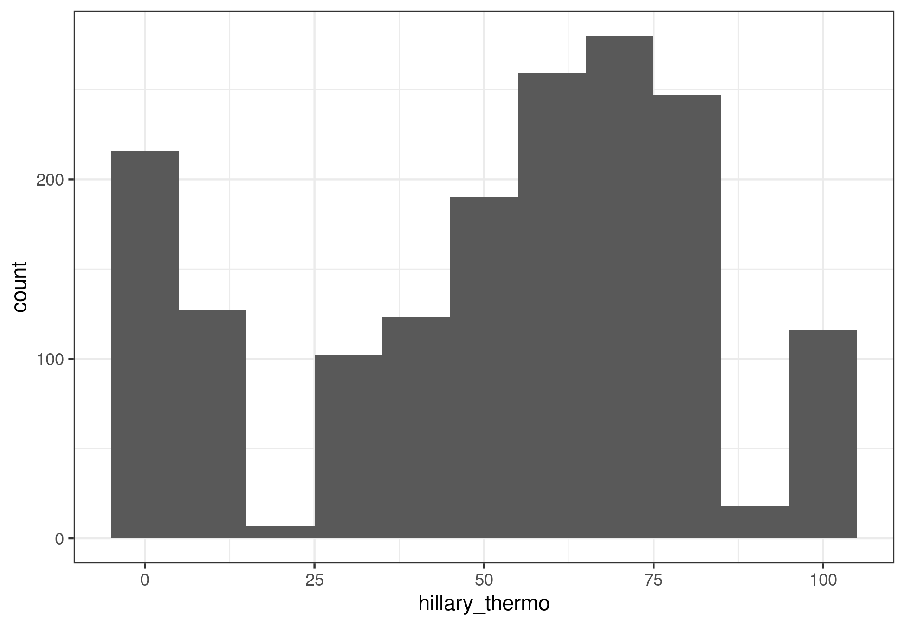
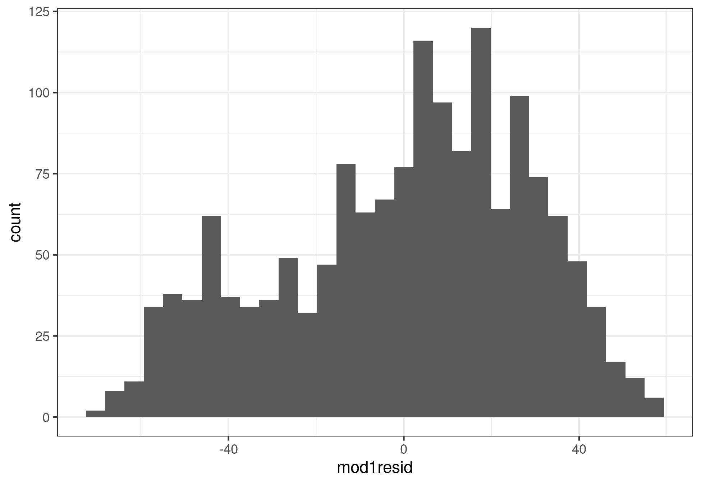
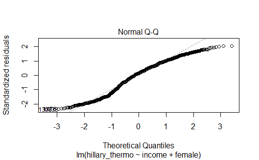
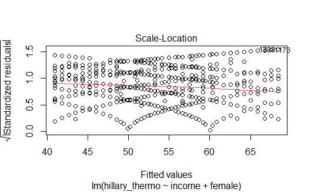

I dag skal vi se på fem ting:

1. Laste inn pakker og data (repetisjon)
2. Bli kjent med data (repetisjon)
3. Forberede data for analyse 
4. Multippel regresjonanalyse
5. Multippel regresjonsanalyse med samspill
6. Presentasjon av regresjonsresultater i tabell

# Laste inn pakker
Det aller første vi gjør er å laste inn pakkene vi skal bruke i dag ved hjelp av `library(pakkenavn)`:


```r
library(tidyverse)
```

```
## -- Attaching packages --------------------------------------- tidyverse 1.3.1 --
```

```
## v ggplot2 3.3.5     v purrr   0.3.4
## v tibble  3.1.6     v dplyr   1.0.7
## v tidyr   1.1.4     v stringr 1.4.0
## v readr   2.1.1     v forcats 0.5.1
```

```
## -- Conflicts ------------------------------------------ tidyverse_conflicts() --
## x dplyr::filter() masks stats::filter()
## x dplyr::lag()    masks stats::lag()
```

```r
library(stargazer)
```

```
## 
## Please cite as:
```

```
##  Hlavac, Marek (2018). stargazer: Well-Formatted Regression and Summary Statistics Tables.
```

```
##  R package version 5.2.2. https://CRAN.R-project.org/package=stargazer
```

Dersom du ikke har brukt disse pakkene før må du huske å kjøre `install.packages("pakkenavn")` først. Dersom du får en feilmelding av typen "Error in library(pakkenavn) : there is no package called 'pakkenavn'" så kan det indikere at pakken ikke er installert. Prøv å kjøre `install.packages("pakkenavn")` og `library(pakkenavn)` igjen. 

# Laste inn data
Det neste vi skal gjøre er å laste inn datasettet vi skal jobbe med i dag. Vi skal jobbe videre med datasettet fra Kellstedt og Whitten som vi kikket litt på i seminar 4. Disse dataene er i `csv`-format og vi bruker derfor funksjonen `read.csv()`. Husk at hvilken funksjon du bruker for å laste inn data avhenger av hvilket format dataene har. Dersom du er usikker på hvilken funksjon du skal bruke så sjekk dokumentet jeg har lastet opp på Canvas. Vi laster inn data og lagrer som et objekt i environment: 


```r
# Bytt ut det som står i '' med din egen filbane:
ANES1996small <- read.csv("../../data/ANES1996small.csv")
```

# Bli kjent med data 
I dag skal vi teste to hypoteser fra kapittel 11 i Kellstedt og Whitten (side 247):
* Alt annet likt, så vil rikere individer gi Hillary Clinton lavere score.
* Alt annet likt, så vil kvinner gi Hillary Clinton en høyere score.

Det er alltid lurt å bli litt kjent med datasettet før en begynner å kjøre analyser. Vi har sett på flere koder for dette, blant annet i seminar fem, men vi gjentar noen av dem her. 

Vi finner navnene på variablene: 

```r
names(ANES1996small)
```

```
##  [1] "v960066"  "v960067"  "v960070"  "v960071"  "v960073"  "v960115" 
##  [7] "v960119"  "v960272"  "v960281"  "v960284"  "v960292"  "v960293" 
## [13] "v960365"  "v960385"  "v960420"  "v960568"  "v960571"  "v960605" 
## [19] "v960606"  "v960610"  "v960701"  "v961039"  "v961300"  "religion"
```

Dette er ikke veldig intuitive variabelnavn så senere skal vi endre navn på de vi skal bruke i analysen vår. 

Vi kan bruke `View()` for å undersøke datasettet nærmere: 


```r
View(ANES1996small)
```

Et alternativ til view for å bare se noen observasjoner er `head()`:


```r
head(ANES1996small)
```

```
##   v960066 v960067 v960070 v960071 v960073 v960115 v960119 v960272 v960281
## 1       1       1       3       3       2       1     574       0       0
## 2       1       1       2       2       1       1       0      60      30
## 3       1       1       2       2       2       1       0      70      85
## 4       1       1       2       2       3       1       0      30      40
## 5       2       1       4       2       3       1       0      40      60
## 6       1       1       3       3       4       1    7323      70      15
##   v960284 v960292 v960293 v960365 v960385 v960420 v960568 v960571 v960605
## 1      85       0      85       6       3       4       3       2      32
## 2      70      30      60       5       1       5       4       1      42
## 3      15      70      30       2       1       2       4       2      53
## 4      60      40      60       5       3       5       1       2      31
## 5      30      40      60       4       3       4       4       1      34
## 6      60      40      60       4       5       5       2       1      73
##   v960606 v960610 v960701 v961039 v961300 religion
## 1       3       3      21      70       5        2
## 2       1       6      22      50       5        2
## 3       1       6      24      70       5        9
## 4       1       7      21      50       5        9
## 5       1       6      21      50       5        2
## 6       1       1      NA      NA      NA        9
```

Ved å bruke for eksempel `View()` får vi mer informasjon om hva slags struktur datasettet vårt har. Dersom vi jobber i store datasett er det lurt å bruke funksjoner som `head()` og `tail()` isteden for å bruke `View()` eller «trykke» på datasettet i environment. `View` krever mye av pc’en. 

For å titte på enkeltvariabler bruker vi syntaksen `datasett$variabel`. Det kan også være praktisk å se denne informasjonen i en tabell. Da kan vi bruke table(`datasett$variabel`). For eksempel så vet jeg at variabelen `v960066` er det man kaller en dikotom variabel for kjønn. At en variabel er dikotom betyr bare at den har to verdier. Denne variabelen tar verdien 1 dersom respondenten er en mann og 2 dersom respondenten er en kvinne. Vi kan undersøke den i en tabell:


```r
table(ANES1996small$v960066, useNA = "always")
```

```
## 
##    1    2 <NA> 
##  768  946    0
```

# Forberede data for analyse
Før vi begynner på regresjonsanalysen så skal vi endre navn på noen av variablene våre så de blir mer intuitive, lage et subset med de variablene vi vil bruke og omkode kjønnsvariabelen til det man kaller en dummyvariabel. En dummyvariabel tar verdiene 0 og 1. 

Først endrer vi navnene på de variabelene vi vil bruke i datasettet vårt ved hjelp av `rename()`. `rename()` har syntaksen `rename(nyttnavn = gammeltnavn)`. I praksis blir det: 


```r
ANES1996small <- ANES1996small %>%
    rename(hillary_thermo = v960281, income = v960701, womenmvmt_thermo = v961039,
        gender = v960066, age = v960605)
```

Vi kan bruke `names()` eller `head()` for å sjekke at omkodingen funket:


```r
names(ANES1996small)
```

```
##  [1] "gender"           "v960067"          "v960070"          "v960071"         
##  [5] "v960073"          "v960115"          "v960119"          "v960272"         
##  [9] "hillary_thermo"   "v960284"          "v960292"          "v960293"         
## [13] "v960365"          "v960385"          "v960420"          "v960568"         
## [17] "v960571"          "age"              "v960606"          "v960610"         
## [21] "income"           "womenmvmt_thermo" "v961300"          "religion"
```

Det neste vi skal gjøre er å bruke `select()` til lage et subset. I `select()` fyller du ut navnet på de variablene du vil beholde og setter et `-` foran variabler du vil fjerne. Dersom jeg vil lage et nytt datasett med variable var1 og var2 kan jeg skrive:


```r
nydata <- data %>%
    select(var1, var2)
```

Dersom jeg vil lage et nytt datasett som inneholder alle variabler bortsett fra var2 så kan jeg skrive: 


```r
nydata <- data %>%
    select(-var2)
```

Merk at jeg gir datasettet et nytt navn til høyre for assignment operatoren `<-`. Det gjør jeg for å beholde det opprinnelige datasettet i tilfelle jeg vil ha med noe mer eller koden ikke gjør det jeg forventet at den skulle gjøre. Vi vil lage et nytt datasett som bare inneholder de variablene vi ga nye navn. Vi kaller det nye datasettet `ANES1996small2` og fyller inn variablene vi vil beholde:


```r
ANES1996small2 <- ANES1996small %>%
    select(hillary_thermo, income, womenmvmt_thermo, gender, age)
```

Det siste vi skal gjøre er å legge til en ny variabel i datasettet vårt. Den skal hete `female` og ta verdien 1 dersom observasjonen har verdien 1 på `gender` og 0 ellers. Dette er en dummyvariabel og vi kan tenke oss at 0 står for nei og 1 står for ja. For å få til dette kombinerer vi `mutate()` som vi bruker for å opprette nye variabler og `ifelse()`:


```r
ANES1996small2 <- ANES1996small2 %>%
    mutate(female = ifelse(gender == 1, 0, 1))
```


I `ifelse()` sier vi at dersom variabelen `gender` har verdien 1, så skal den nye variabelen `female` få verdien 0, dersom `gender` ikke har verdien 1 så skal den nye variabelen `female` få verdien 1. 

Vi sjekker at omkodingen ble riktig ved hjelp av en krysstabell med ny og gammel variabel: 


```r
table(ANES1996small2$female, ANES1996small2$gender, useNA = "always")
```

```
##       
##          1   2 <NA>
##   0    768   0    0
##   1      0 946    0
##   <NA>   0   0    0
```

Før vi ser på multippel regresjonsanalyse så skal vi se litt nærmere på den avhengige variabelen vår. Den avhengige variabelen er `hillary_thermo`. Dette er en såkalt **thermometer rating** der respontenene i American National Election Study (NES) ble spurt hva de føler (i motsetning til hva de mener) om ulike individer eller grupper. Skalaen går  fra 0 til 100 der en score på 50 indikerer at respondenten hverken har varme eller kalde følelser for individet eller gruppen spørsmålet gjelder. Scorer lavere enn 50 indikerer "kalde" følelser, men scorer over 50 indikerer "varme" følelser. Dette kan dere lese mer om i kapittel 10 og 11 i Kellstedt og Whitten. 

Vi kan bruke `summary()` til å undersøke variabelen nærmere:


```r
summary(ANES1996small$hillary_thermo)
```

```
##    Min. 1st Qu.  Median    Mean 3rd Qu.    Max.    NA's 
##    0.00   30.00   60.00   52.81   70.00  100.00      29
```

Fra summary kan vi lese at hele skalaen fra 0 (Min.) til 100 (Max.) er tatt i bruk, at halvparten ga en lavere score enn 60 (Median) og at den gjennomsnittlige scoren var 52.81 (Mean). I tillegg kan vi se at vi mangler informasjon for 29 respondenter (NA's). 

Vi kan også lage et histogram over fordelingen:


```r
ggplot(data = ANES1996small) + geom_histogram(aes(x = hillary_thermo), binwidth = 10) +
    theme_bw()
```




# Multippel regresjonanalyse
Multippel regresjonsanalyse er regresjonanalyse med flere uavhengige variabler. De uavhengige variablene kan være forklaringsvariabler eller variabler du ønsker å kontrollere for. Vi bruker samme funksjon som vi brukte når vi kjørte en regresjonsanalyse med en uavhengig variabel i seminar 5, nemlig `lm()`. Syntaksen er også veldig lik. Vi skiller mellom avhengig variabel og uavhenig variable med `~` og legger til flere uavhengige variabler med `+`. Syntaksen der vi velger å lagre modellen som et objekt, av er avhengig variabel og uv er uavhengig variable blir:


```r
model <- lm(av ~ uv1 + uv2, data = data, na.action = "na.exclude")
```

Når vi kjører regresjoner så vil vi ofte velge å lagre de som et objekt. Det gjør vi for å kunne presentere resultatene på ulike måter i tabeller og plot, bruke informasjonen i modellen til å hente ut predikerte verdier eller kjøre regresjonsdiagnostikk. 

For ordens skyld så gjentar vi hypotesene som vi vil teste som er beskrevet i Kellstedt og Whitten på side 247:
* Alt annet likt, så vil rikere individer gi Hillary Clinton lavere score.
* Alt annet likt, så vil kvinner gi Hillary Clinton en høyere score.

Det betyr at vi vil ha med tre variabler i modellen vår: `hillary_thermo` er avhengig variabel, mens `income` og `female` er de uavhengige variablene. For å kjøre modellen kjører vi følgende kode: 


```r
model1 <- lm(hillary_thermo ~ income + female, data = ANES1996small2, na.action = "na.exclude")
```

Vi kan bruke `summary()` og `stargazer()` for å undersøke resultatene: 


```r
summary(model1)
```

```
## 
## Call:
## lm(formula = hillary_thermo ~ income + female, data = ANES1996small2, 
##     na.action = "na.exclude")
## 
## Residuals:
##     Min      1Q  Median      3Q     Max 
## -68.421 -18.569   4.191  21.431  58.998 
## 
## Coefficients:
##             Estimate Std. Error t value Pr(>|t|)    
## (Intercept)  61.1804     2.2204  27.554  < 2e-16 ***
## income       -0.8408     0.1179  -7.134 1.50e-12 ***
## female        8.0814     1.4952   5.405 7.51e-08 ***
## ---
## Signif. codes:  0 '***' 0.001 '**' 0.01 '*' 0.05 '.' 0.1 ' ' 1
## 
## Residual standard error: 28.68 on 1539 degrees of freedom
##   (172 observations deleted due to missingness)
## Multiple R-squared:  0.06007,	Adjusted R-squared:  0.05884 
## F-statistic: 49.17 on 2 and 1539 DF,  p-value: < 2.2e-16
```

Ved å bruke `summary` får vi informasjon om koeffisienten (Estimate), standardfeilen (Std. Error), t-verdien (t-value) og p-verdien (Pr(>|t|)). Av summary kan vi derfor lese at koeffisienten til income når vi kontrollerer for female er -0.8408 og p-verdien er 0.00000000000150. P-verdien er lavere enn 0.01 og vi kan derfor si at koeffisienten er signifikant på 1 prosents nivå. Dersom du lurer på hva tallene med e- blir skrevet ut så kan du f.eks. bruke denne siden: [converthere.com/](https://converthere.com/numbers/10e+6-written-out)


```r
stargazer(model1, type = "text")
```

```
## 
## ===============================================
##                         Dependent variable:    
##                     ---------------------------
##                           hillary_thermo       
## -----------------------------------------------
## income                       -0.841***         
##                               (0.118)          
##                                                
## female                       8.081***          
##                               (1.495)          
##                                                
## Constant                     61.180***         
##                               (2.220)          
##                                                
## -----------------------------------------------
## Observations                   1,542           
## R2                             0.060           
## Adjusted R2                    0.059           
## Residual Std. Error     28.684 (df = 1539)     
## F Statistic          49.174*** (df = 2; 1539)  
## ===============================================
## Note:               *p<0.1; **p<0.05; ***p<0.01
```

For å undersøke hva som skjer med koeffisienten til en uavhengig variabel så kan vi kjøre en redusert modell og sammenligne disse i en tabell: 


```r
model0 <- lm(hillary_thermo ~ income, data = ANES1996small2, na.action = "na.exclude")
```

For å lage tabellen så bruker vi `stargazer()`:


```r
stargazer(model0, model1, type = "text")
```

```
## 
## =====================================================================
##                                    Dependent variable:               
##                     -------------------------------------------------
##                                      hillary_thermo                  
##                               (1)                      (2)           
## ---------------------------------------------------------------------
## income                     -0.962***                -0.841***        
##                             (0.117)                  (0.118)         
##                                                                      
## female                                               8.081***        
##                                                      (1.495)         
##                                                                      
## Constant                   67.445***                61.180***        
##                             (1.911)                  (2.220)         
##                                                                      
## ---------------------------------------------------------------------
## Observations                 1,542                    1,542          
## R2                           0.042                    0.060          
## Adjusted R2                  0.042                    0.059          
## Residual Std. Error    28.945 (df = 1540)       28.684 (df = 1539)   
## F Statistic         67.891*** (df = 1; 1540) 49.174*** (df = 2; 1539)
## =====================================================================
## Note:                                     *p<0.1; **p<0.05; ***p<0.01
```

Vi kan legge til tittel og variabelnavn for at tabellen skal bli mer forståelig:


```r
stargazer(model0, model1, type = "text", title = c("Results from regression analysis"),
    covariate.labels = c("Income", "Female", "Intercept"), dep.var.labels = "Hillary Clinton Thermometer score")
```

```
## 
## Results from regression analysis
## =====================================================================
##                                    Dependent variable:               
##                     -------------------------------------------------
##                             Hillary Clinton Thermometer score        
##                               (1)                      (2)           
## ---------------------------------------------------------------------
## Income                     -0.962***                -0.841***        
##                             (0.117)                  (0.118)         
##                                                                      
## Female                                               8.081***        
##                                                      (1.495)         
##                                                                      
## Intercept                  67.445***                61.180***        
##                             (1.911)                  (2.220)         
##                                                                      
## ---------------------------------------------------------------------
## Observations                 1,542                    1,542          
## R2                           0.042                    0.060          
## Adjusted R2                  0.042                    0.059          
## Residual Std. Error    28.945 (df = 1540)       28.684 (df = 1539)   
## F Statistic         67.891*** (df = 1; 1540) 49.174*** (df = 2; 1539)
## =====================================================================
## Note:                                     *p<0.1; **p<0.05; ***p<0.01
```

Det er litt mer komplisert å plotte regresjonslinjer når vi har flere uavhengig variabler. Det er fordi verdien på avhengig variabel nå vil avehenge av en kombinasjon av ulike verdier på de uavhengige variablene. Det finnes måter å gjøre det på og det finnes pakker som forenkler denne jobben, men vi kommer ikke til å se på dette i seminar.  
Før vi går videre til modelldiagnostikk så legger vi til en variabel med de predikerte verdiene i datasettet. Jeg lager også en variabel for residualene som vi skal se nærmere på senere:


```r
ANES1996small2 <- ANES1996small2 %>%
    mutate(mod1fitted = fitted(model1), mod1resid = resid(model1))
```


# Multippel regresjon med samspillsledd
Modellene vi har laget til nå har vært additive modeller. Nå skal vi legge til et samspillsledd mellom kjønn og hvordan man stiller seg til kvinnebevegelsen. Hypotesen er presentert i Kellstedt og Whitten på side 256:

* Effekten av hvordan en respondent føler om kvinnebevegelsen på hvordan de føler om  Hillary Clinton vil være sterkere for kvinner enn for menn. 


Først kjører vi den additive modellen:

```r
model2additiv <- lm(hillary_thermo ~ female + womenmvmt_thermo, data = ANES1996small2,
    na.action = "na.exclude")
```

Vi legger til samspillsledd i modellen vår ved å bruke `*` mellom de to variablene vi vil undersøke samspillet av:


```r
model2samspill <- lm(hillary_thermo ~ female * womenmvmt_thermo, data = ANES1996small2,
    na.action = "na.exclude")

summary(model2additiv)
```

```
## 
## Call:
## lm(formula = hillary_thermo ~ female + womenmvmt_thermo, data = ANES1996small2, 
##     na.action = "na.exclude")
## 
## Residuals:
##     Min      1Q  Median      3Q     Max 
## -73.920 -16.175   3.254  17.471  86.884 
## 
## Coefficients:
##                  Estimate Std. Error t value Pr(>|t|)    
## (Intercept)       5.98451    2.13429   2.804  0.00511 ** 
## female            7.13137    1.36590   5.221 2.04e-07 ***
## womenmvmt_thermo  0.67936    0.03165  21.463  < 2e-16 ***
## ---
## Signif. codes:  0 '***' 0.001 '**' 0.01 '*' 0.05 '.' 0.1 ' ' 1
## 
## Residual standard error: 25.76 on 1463 degrees of freedom
##   (248 observations deleted due to missingness)
## Multiple R-squared:  0.2652,	Adjusted R-squared:  0.2642 
## F-statistic:   264 on 2 and 1463 DF,  p-value: < 2.2e-16
```

```r
summary(model2samspill)
```

```
## 
## Call:
## lm(formula = hillary_thermo ~ female * womenmvmt_thermo, data = ANES1996small2, 
##     na.action = "na.exclude")
## 
## Residuals:
##     Min      1Q  Median      3Q     Max 
## -76.935 -16.711   3.214  18.271  83.226 
## 
## Coefficients:
##                         Estimate Std. Error t value Pr(>|t|)    
## (Intercept)              1.56065    3.03991   0.513  0.60776    
## female                  15.21339    4.18739   3.633  0.00029 ***
## womenmvmt_thermo         0.75375    0.04824  15.624  < 2e-16 ***
## female:womenmvmt_thermo -0.13040    0.06387  -2.042  0.04138 *  
## ---
## Signif. codes:  0 '***' 0.001 '**' 0.01 '*' 0.05 '.' 0.1 ' ' 1
## 
## Residual standard error: 25.74 on 1462 degrees of freedom
##   (248 observations deleted due to missingness)
## Multiple R-squared:  0.2673,	Adjusted R-squared:  0.2658 
## F-statistic: 177.8 on 3 and 1462 DF,  p-value: < 2.2e-16
```

# Presentasjon av regresjonsresultater i tabell

Her skal vi se på hvordan vi kan sammenligne de to modellene i en fin tabell. Vi skal bruke `stargazer()`, men kommer til å spesifisere noen flere argumenter enn tidligere. Vi bruker `type =` til å spesifisere hvilket format vi vil ha tabellen i. `covariate.labels` bruker vi til å legge til nye navn til de uavhengige variablene i modellen. Det er veldig viktig å legge inn navnene i samme rekkefølge som i regresjonsmodellen, om ikke risikerer vi å gi feil navn til variablene. `Dep.var.labels` bruker til å gi navn til avhengig variabel:


```r
stargazer(model2additiv, model2samspill, type = "text", title = c("Tabell fra Kellstedt og Whitten s. 257"),
    covariate.labels = c("Female", "Women's Movement Thermometer", "Women's Movement Thermometer x Female",
        "Intercept"), dep.var.labels = "Hillary Clinton Thermometer score")
```

```
## 
## Tabell fra Kellstedt og Whitten s. 257
## =========================================================================================
##                                                       Dependent variable:                
##                                       ---------------------------------------------------
##                                                Hillary Clinton Thermometer score         
##                                                  (1)                       (2)           
## -----------------------------------------------------------------------------------------
## Female                                        7.131***                  15.213***        
##                                                (1.366)                   (4.187)         
##                                                                                          
## Women's Movement Thermometer                  0.679***                  0.754***         
##                                                (0.032)                   (0.048)         
##                                                                                          
## Women's Movement Thermometer x Female                                   -0.130**         
##                                                                          (0.064)         
##                                                                                          
## Intercept                                     5.985***                    1.561          
##                                                (2.134)                   (3.040)         
##                                                                                          
## -----------------------------------------------------------------------------------------
## Observations                                    1,466                     1,466          
## R2                                              0.265                     0.267          
## Adjusted R2                                     0.264                     0.266          
## Residual Std. Error                      25.765 (df = 1463)        25.737 (df = 1462)    
## F Statistic                           263.974*** (df = 2; 1463) 177.753*** (df = 3; 1462)
## =========================================================================================
## Note:                                                         *p<0.1; **p<0.05; ***p<0.01
```
Dersom vi vil lagre denne på PC-en og åpne den i word så byttr vi til `type = "html"` og spesifiserer et filnavn i `out = `:


```r
stargazer(model2additiv, model2samspill, type = "html", title = c("Tabell fra Kellstedt og Whitten s. 257"),
    covariate.labels = c("Female", "Women's Movement Thermometer", "Women's Movement Thermometer x Female",
        "Intercept"), dep.var.labels = "Hillary Clinton Thermometer score", out = "mod2_tabell.htm")
```


# Modelldiagnostikk
Videre skal vi se på noen grafiske verktøy for å vurdere om enkelteforutsetninger for OLS er oppfylt. Hvor mye tid vi bruker på dette på seminar vil avhenge av hvor god tid vi får. Dersom dere vil se nærmere på dette så anbefaler jeg å ta en titt på [denne siden](https://github.com/langoergen/stv4020aR/blob/master/docs/Regresjonsdiagnostikk.md).

Det første vi skal se på er restleddenes fordeling. For å vurdere denne så bruker vi restleddene/residualene som vi lagret i datasettet tidligere. Vi kan bruke `ggplot()` til å vurdere om restleddenes fordelingen: 


```r
ggplot(data = ANES1996small2, aes(x = mod1resid)) + geom_histogram() + theme_bw()
```


 

Vi kan også plotte restleddene mot modellens verdier. Dette gjør vi for å vurdere eventuell hetroskedastisitet. Vi bruker de predikerte verdiene som vi lagret i datasettet på x aksen og modellens restledd på y aksen. Vi legger til de ulike enhetene med `geom_point`, så trekker vi en linje gjennompunktene med `geom_smooth()`.


```r
ggplot(data = ANES1996small2, aes(x = mod1fitted, y = mod1resid)) + geom_point() +
    geom_smooth() + theme_bw()
```


Slike plott kan være noe vanskelig å tolke. Hvor enkel eller vanskelig tolkningen blir avhenger ofte av hvordan variablene våre er kodet. 

Vi kan også bruke plot() for å få ulike figurer for diagnosistikk, vi vil få 4 ulike plot med denne funksjonen. Disse plottene er ikke like fine som de vi lager i ggplot, men de kan hjelpe oss med å få en rask oversikt over ulike diagnosistikk:


```r
plot(model1)
```







